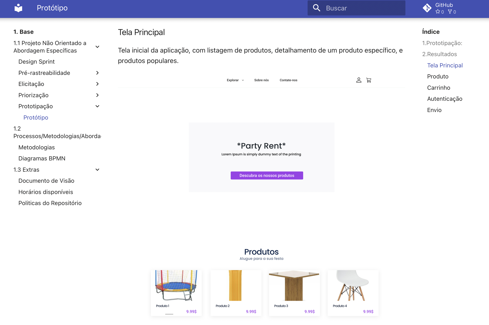
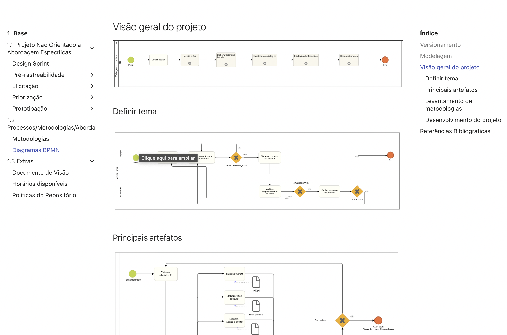

# 2021.2*G7*-PartyRent

**Código da Disciplina**: FGA0208 
**Número do Grupo**: 07 

## Alunos

| Matrícula  | Aluno                                    |
| ---------- | ---------------------------------------- |
| 15/0007329 | Caio Gabriel Araujo Medeiros             |
| 15/0125682 | Flavio Vieira Leao                       |
| 18/0102711 | Jaime Juan de Castro Feliciano Damasceno |
| 17/0069991 | João Victor Max Bisinotti de Oliveira    |
| 18/0105604 | Luis Gustavo Ferreira Marques            |
| 17/0041042 | Marcos Gabriel Tavares                   |
| 18/0127535 | Mateus Brandão Teixeira                  |
| 15/0042817 | Matheus Clemente Caravalho de Azevedo    |
| 19/0044390 | Victor Rayan Ferreira                    |

## Sobre

A PartyRent é uma pequena empresa voltada a realização de aluguel para artigos diversos para festas. Mesas, cadeiras, móveis diversos e outros itens para a realização de aniversário, casamento, formaturas e demais eventos. A ideia do Projeto e realizar uma melhora no processo da empresa, realizando o desenvolvimento de uma ferramenta web para facilitar o processo de aluguel dos itens.

## Screenshots Primeira Entrega <<FOCO: DSW(Base)>>

## Vídeo(s) Primeira Entrega <<FOCO: DSW(Base)>>

[1.1 Projeto Não Orientado a Abordagem Específicas](https://youtu.be/0TakkRStXLM)

[1.2 Processos/Metodologias/Abordagens](https://youtu.be/OKHi1pNN1YU)

[1.3 Extras](https://www.youtube.com/embed/0MUihEyvvKA)

## Screenshots Segunda Entrega <<FOCO: DSW(Modelagem)>>

## Vídeo(s) Segunda Entrega <<FOCO: DSW(Modelagem)>>

[1.1 Diagramas Estáticos](https://youtu.be/pXTeUW1cIAY)

[1.2 Diagramas Dinâmicos](https://youtu.be/28nr1x4xEpI)

Sem vídeo dedicado à Modelagem Ágil (OBS: Professora)

[1.3 Iniciativa Extras](https://youtu.be/YmTdhNQjAko)

## Screenshots Terceira Entrega <<FOCO: DSW(Padrões de Projeto)>>

## Vídeo(s) Terceira Entrega <<FOCO: DSW(Padrões de Projeto)>>

[Entrega 3.1 Grasp(s)](https://youtu.be/GumChCJuBbY)

[Entrega 3.2 GoF(s)](https://youtu.be/p7XSDCEZl8w)

Sem vídeo dedicado aos Padrões Emergentes (OBS: Professora)

[Entrega 3.3 Extras](https://youtu.be/RyAwOCwsFxA)

## Screenshots Quarta Entrega (FINAL) <<FOCOS: Arquitetura & Reutilização de Software & PROJETO FINAL>>

## Vídeo(s) Quarta Entrega (FINAL) <<FOCOS: Arquitetura & Reutilização de Software & PROJETO FINAL>>

[Entrega 4.1 DAS)]()

[Entrega 4.2 Documento de Reutilização]()

[Entrega 4.3 Iniciativa Extra - Post Mortem]()

[Entrega 4.4 Apresentação do Produto]()

## Descritivo dos Principais Aspectos Técnicos

**Principal(is) Metodologia(s) Adotada(s)**: Scrum e XP 
**Principais Linguagens Utilizadas e/ou Pretendidas**: Typescript e Python 
**Principais Tecnologias Utilizadas e/ou Pretendidas**: React, React-Bootstrap, Django e Django-REST 
**Principal(is) Estilo(s) Arquitetural(is) Adotado(s)**: MVT 

## O Projeto está rodando?

(x) SIM
( ) NÃO

## Informações Complementares

Demais informações podem ser encontradas nos seguintes repositórios:

* [Front-End](https://github.com/UnBArqDsw2021-2/2021.2_G7_PartyRent_Frontend)
* [Back-End](https://github.com/UnBArqDsw2021-2/2021.2_G7_PartyRent_Backend)
