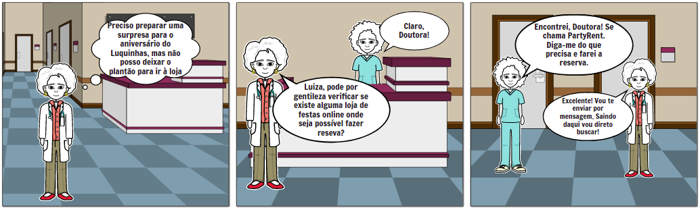

## 1. Histórico de Versão

| Data       | Versão | Descrição            | Autor           |
| ---------- | ------ | -------------------- | --------------- |
| 03/02/2022 | 1.0    | Criação do Documento | João Victor Max |
| 03/02/2022 | 2.0    | Introduzindo novo tópico | João Victor Max |
| 21/02/2022 | 2.1    | Revisão | Jaime Juan |

## 2. Metodologia

Storyboard é uma técnica que utiliza ilustrações em sequência, comumente representadas na forma de histórias em quadrinhos, colagens, desenhos ou fotografias, para contar uma história que representa situações de uso do sistema em questão, demonstrando como o mesmo se apresenta como solução de determinado problema.

## 3. Ferramenta

Para a execução do Storyboard foi utilizada a ferramenta Storyboard That, uma plataforma de criação de fácil utilização, que oferece uma versão gratuita e uma por assinatura.

## 4. Resultado

[Figura 1: Storyboard](storyboard_PR.png)
