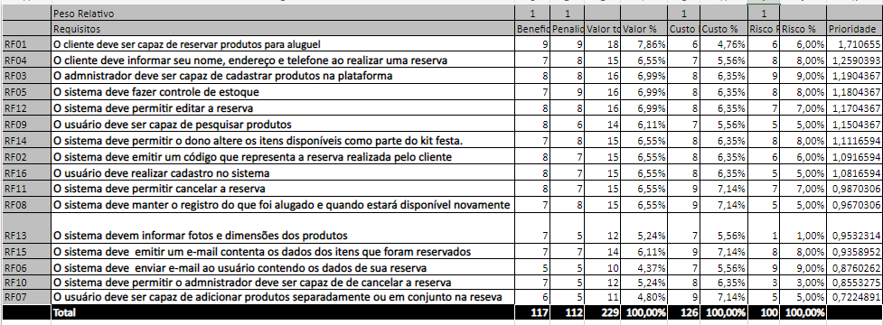

## Histórico de Versão

| Data       | Versão | Descrição            | Autor(es)    |
| ---------- | ------ | -------------------- | ------------ |
| 02/02/2022 | 1.0    | Criação do Documento | Luis Marques |
| 21/02/2022 | 1.1    | Revisão | Jaime Juan |

# First Things First

## 1. Introdução

O First Things First é uma técnica de priorização onde há um levantamento de dados de beneficio, custo e risco relacionado a cada requisito levantado.

## 2. Metodologia

Nessa prática de priorização, é construída uma tabela de forma que equilibre os posicionamentos do cliente e do desenvolvedor. Para isso, devem ser seguidos 8 (oito) passos:

**Passo 1**: Listar todos os requisitos em uma tabela, retirando aqueles dependentes de outro requisito.

**Passo 2**: Estimar o benefício relativo que cada recurso fornece ao cliente ou ao negócio de 1 a 9, em que 1 é o menos significativo e 9 o mais significativo.

**Passo 3**: Estimar a penalidade que o negócio sofreria, se o recurso não fosse incluído, de 1 a 9, em que 1 é o com menor penalidade e 9 maior penalidade.

**Passo 4**: A coluna Valor Total é a soma do (Benefício Relativo _Peso Relativo + Penalidade Relativa_ Peso Relativo), o Peso Relativo utilizado nesse caso foi de 1.

**Passo 5**: Estimar o custo relativo de implementação de cada requisito, de 1 a 9.

**Passo 6**: Estimar o grau relativo ao risco a cada requisito de uma escala de 1 a 9.

**Passo 7**: Calcular a prioridade para cada requisito usando: valor % / (custo % _Peso custo + risco %_ Peso Risco). O Peso Custo e Risco aqui utilizados foram iguais a 1.

**Passo 8**: Ordenar a lista em ordem decrescente de prioridade.

## 3. Aplicação da técnica

[Figura 1: First Things First - Tabela](First_T_First.png)

Após estes passos aplicados a tabela resultante fica ordenada do requisito que deve ter maior prioridade para implementação, até o software que deve ter menor prioridade na implementação.

## Referências

> First Things First: Prioritizing Requirements.<https://www.processimpact.com/articles/prioritizing.pdf>. Disponivel em 02/02/2022
