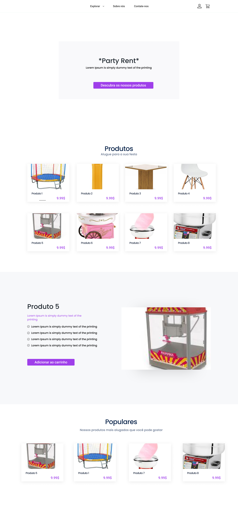
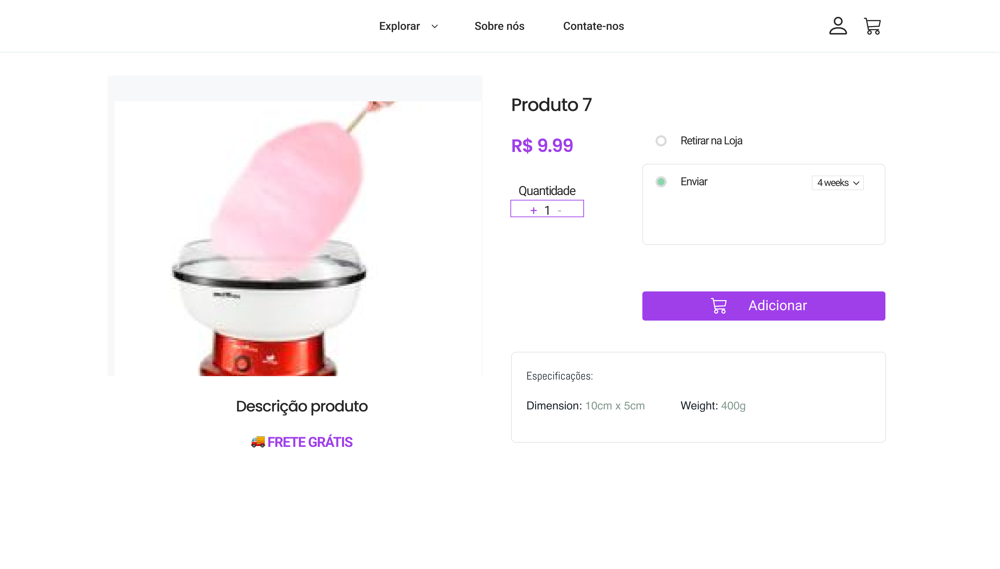
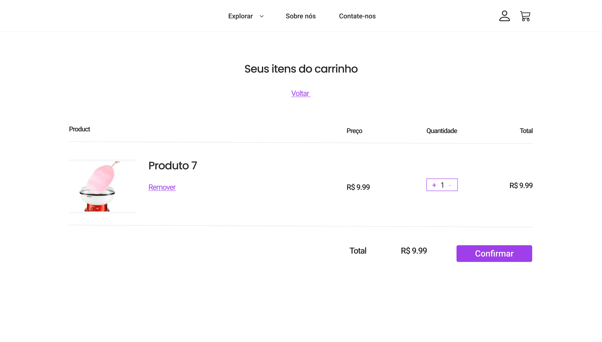
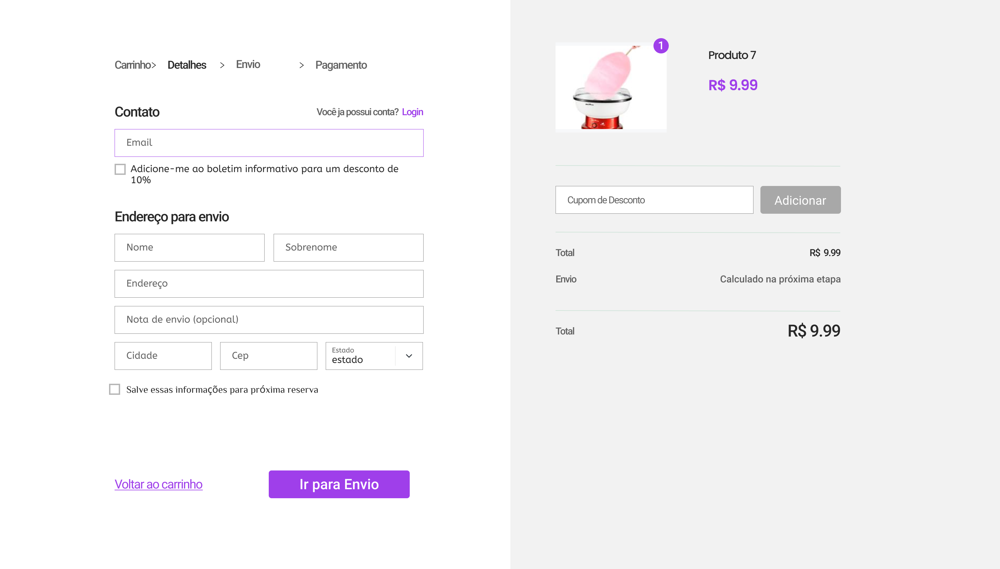
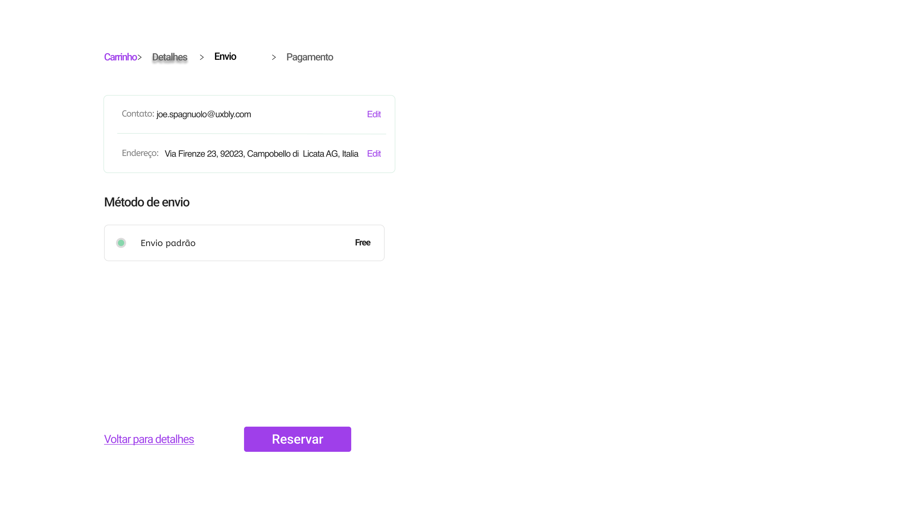

| Data       | Versão | Descrição            | Autor(es)    |
| ---------- | ------ | -------------------- | ------------ |
| 03/02/2022 | 1.0    | Criação do Documento | Mateus Brandão |
| 04/02/2022 | 1.1    | Telas do protótipo   | Mateus Brandâo & Matheus Clemente|

## 1.Prototipação:
Para a prototipação foram utilizados Protótipos de média fidelidade contruídos na ferramenta Figma, que tentam se aproximar mehor da interface final.Por meio dele foi possível organizar melhor as ideias,testar fluxos e tarefas e também validar a estruturar da interface.

## 2.Resultados
A seguir as telas construídas para esse protótipo:

### Tela Principal
Tela inicial da aplicação, com listagem de produtos, detalhamento de um produto específico, e produtos populares.

### Produto
Seleciona quantidade e adiciona ao carrinho.

### Carrinho
Possibilita a verificação dos itens selecionados para que se prossiga com a solicitação de aluguel.

### Autenticação
E-mail e endereço para registro do pedido.

### Envio
Finalização do processo

