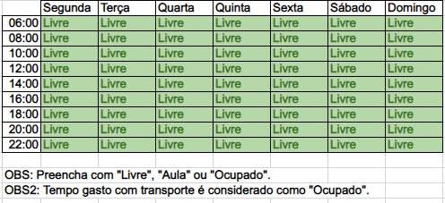
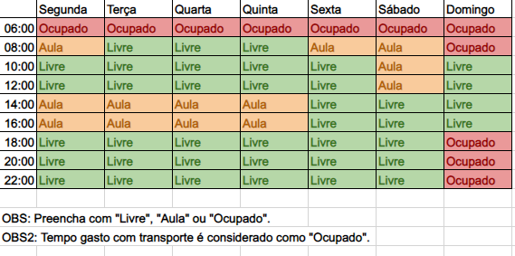
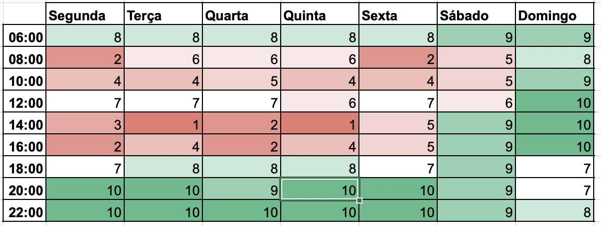

## Histórico de Versão

| Data       | Versão | Descrição            | Autor(es)    |
| ---------- | ------ | -------------------- | ------------ |
| 02/02/2022 | 1.0    | Criação do Documento | Luis Marques |
| 21/02/2022 | 1.1    | Criação do Documento | Jaime Juan |

# Disponibilidade de Horários

## 1. Introdução

Para que fosse possível saber a disponibilidade de cada integrante do grupo de forma separada, foi feita uma planilha utilizando o excel. Tendo assim um panorama geral da disponibilidade dos integrante.

## 2. Metodologia

Para aplicação dessa técnica foi gerado um arquivo no excel, com diversas abas, sendo a principal e mais 10 abas, uma para cada integrante. Cada aba ja continha um template pré-pronto para cada integrante, onde este somente precisava preencher os seus horários que dispunham para realização das demais demandas do projeto.

[Figura 1: Template](tabelainicial.png)

Com o template inicial o integrante preenchia os horários semanais que estava ocupado ou em aula. Como demonstrado a seguir:

[Figura 2: Exemplo por integrante](ExemploIntegrante.png)

Após o preenchimento de todos os integrantes os dados eram somados na aba principal, tornando assim mais facil a visualização da disponibilidade de toda a equipe.

## 3. Resultado

Com o preenchimento dos dados podemos ver que o horário de maior disponibilidade dos integrantes do grupo seria entre 20 e 22 horas durante os dias da semana. De forma que as reuniões para o projeto deverão preferencialmente ocorrer nestes horários.

[Figura 3: Quadro geral](DadosCompilados.png)

