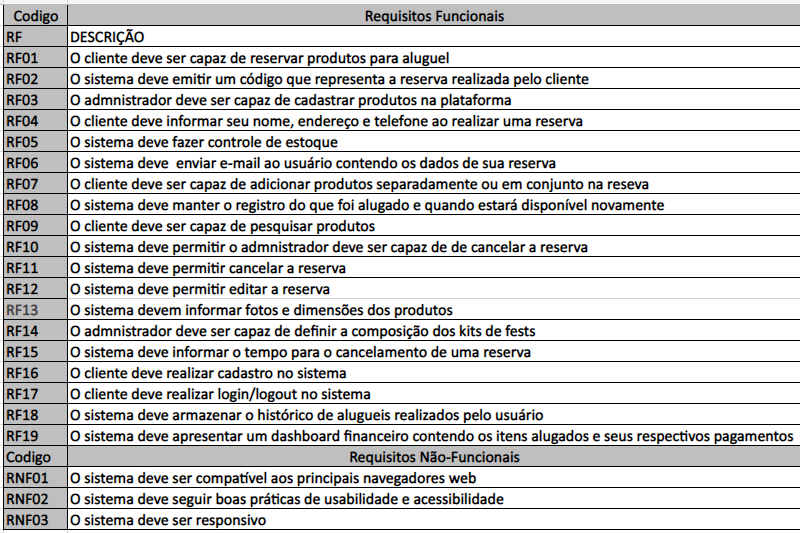

## Versionamento

| Data       | Versão | Descrição              | Autor(es)    |
| ---------- | ------ | ---------------------- | ------------ |
| 02/02/2022 | 1.0    | Criação do Documento   | Luis Marques |
| 04/02/2022 | 2.0    | Atualização dos quadro | Luis Marques |

# Brainstorm

## 1. Objetivo

-   Foi utilizado o brainstorm como uma das etapas do design sprint para um maior alinhamento das ideias do grupo para a aplicação que seria desenvolvida. Alinhando assim as expectativas sobre o projeto e o produto, facilitando assim a determinação de requisitos do projeto.

## 2. Whiteboard

-   Utilizamos a ferramente microsoft whiteboard para que de forma colaborativa fosse possível cada integrante preencher sua ideia de requisito necessário para a aplicação.

## 3. Divisão dos requisitos

-   Para melhor entendimento e visualização dos requisitos foi realizada uma divisão dos requisitos listados entre requisitos funcionais e não funcionais através de um documento word com a inclusão de tabelas.

utilizando as técnicas de MoSCoW e First thing First os requisitos acima listados foram compilados com os requisitos levantados no storyboard e priorizados.

## Referências

> What is Brainstorming?.<https://www.interaction-design.org/literature/topics/brainstorming>. Acessado em 02/02/2022
