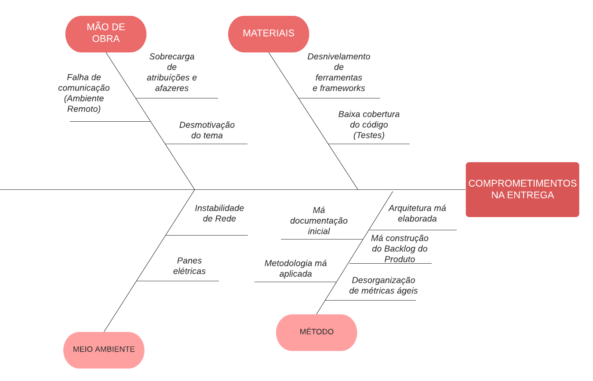

  # Causa e Efeito

## Histórico de versão
|Data |Versão |Descrição| Autor|
|--- |--- |--- |--- |
| 03/02/2022 | 1.0 | Criação e elaboração do documento | Jaime Juan

## 1. Introdução
Um diagrama de causa e efeito, também conhecido como diagrama de Ishikawa ou diagrama de espinha de peixe, é um artefato visual sem orientação metodológica específica. O criador dessa ferramenta, Kaoru Ishikawa, a desenvolveu com uma ideia básica: fazer as pessoas pensarem sobre as possíveis causas e motivos de um problema, e ela pode ser usada por qualquer pessoa, desde simples funcionários até gerentes de projetos.

Usar um diagrama de causa e efeito é essencial para organizar as informações de brainstorming sobre as possíveis causas de um problema. Trabalhar com sua equipe para desenvolver um diagrama de causa e efeito pode ajudá-lo a comparar a importância relativa de diferentes causas.

## 2. Metodologia
Foi tido como referência o método 6M, método esse muito utilizado para essas ocasiões. Nesse método é analisado 4 objetos.

Temos assim:
- Mão de obra: Problemas que envolvem os motivos individuais da equipe.
- Materiais: Utilização das tecnologias e técnicas na produção e implementação da solução computacional.
- Meio Ambiente: Causas que são difíceis de serem resolvidas pelo time por suas particularidades.
- Método: Falha na implementação do conteúdo metodológico que envolve a mais importante produção do grupo.

## 3. Diagrama

[Figura 1: Diagrama Causa-Efeito](diagram-causa&efeito.png)

## Referências
> ANDRADE, Luiza. Diagrama de Ishikawa: o que é e como fazer. Siteware, 2017. Disponível em: https://www.siteware.com.br/blog/metodologias/diagrama-de-ishikawa/. Acesso em: 3 de fevereiro de 2022.

> SILVEIRA, Cristiano Bertulucci.Diagrama de Ishikawa, Causa e Efeito ou Espinha de Peixe. Citisystems, 2012. Disponível em: https://www.citisystems.com.br/diagrama-de-ishikawa/. Acesso em: 3 de fevereiro de 2022.

> "O que são os 6M no diagrama de causa e efeito?": https://radardeprojetos.com.br/o-que-sao-os-6m-no-diagrama-de-causa-e-efeito/. Acesso em: 3 de fevereiro de 2022.