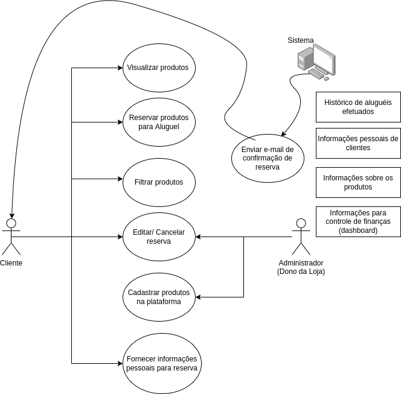

## 1. Objetivo

Rich picture é uma ferramenta composta por imagens, textos, símbolos e ícones, que servem para expressar ideias. Resumidamente, é o esboço que vai definir o ponto de partida da solução que será proposta, definindo suas entidades e relacionamentos, diante do problema apresentado.

## 2. Resultado

## 3. Versionamento
|Data |Versão |Descrição| Autor|
|--- |--- |--- |--- |
|03/02/2022 |1.0 | Criação do Documento| João Victor Max|