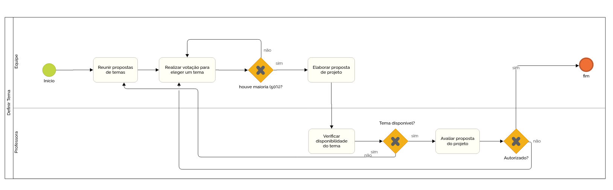
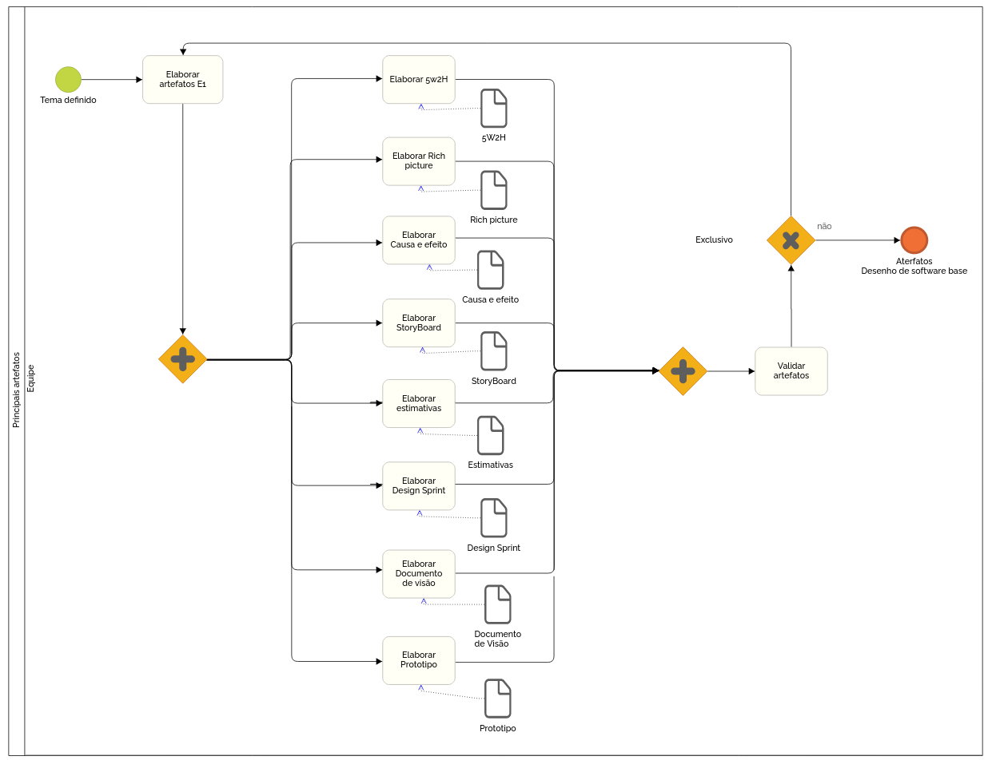
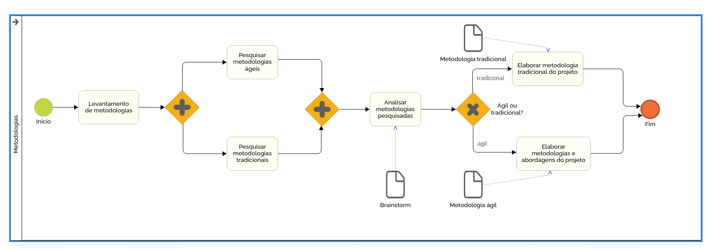
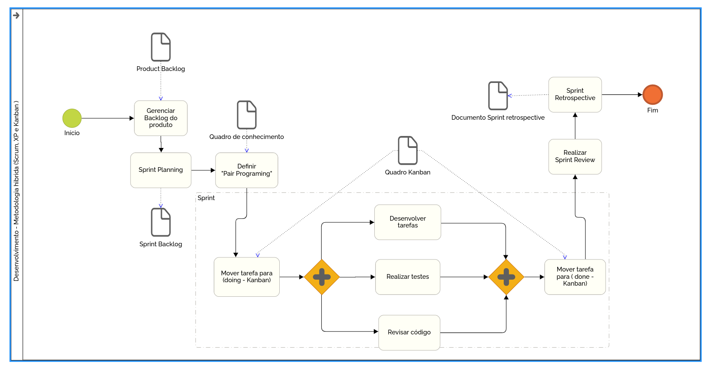

# DIAGRAMAS BPMN
---

## Versionamento
| Data | Versão | Descrição | Autores |
| -------- | -------- | -------- | ---|
| 02/02/2022     |  1.0  | Criação do documento  | Flavio Vieira
| 02/02/2022    |  1.1    | Diagrama principais artefatos e Definir tema     |  Flavio Vieira
| 04/02/2022    |  1.2    | Diagrama metodologias, desenvolvimento e visao geral     |  Flavio Vieira

## Modelagem

BPMN (Business Process Model and Notation) é uma notação gráfica de gerenciamento de processos de negócio e tem como objetivo facilitar o entendimento do usuário acerca dos processos.  

### Visão geral do projeto  
 
### Definir tema

  

### Principais artefatos

  

### Levantamento de metodologias

  
 

### Desenvolvimento do projeto

  

## Referências Bibliográficas
* Business Process Modeling Notation BPMN. [ebook] Business Process Modeling Notation BPMN: Decanato de Planejamento e Orçamento. Disponível em: http://www.dpo.unb.br/images/phocadownload/dpr/biblioteca/BPMN.pdf [Accessado 28 September 2020].

* CASTRO, Bruna. Notação BPMN: O que é e quando usar? Guia completo. Blog SML Brasil. Disponível em: https://blog.smlbrasil.com.br/o-que-significa-bpmn/. Acesso em: 17 de fevereiro de 2021.
  