# Documento de Arquitetura de Software

## Histórico de Versão

| Data       | Versão | Modificação                                            | Autor                                                                                                                                       |
| :--------- | :----- | :----------------------------------------------------- | :------------------------------------------------------------------------------------------------------------------------------------------ |
| 19/03/2022 | 1.0    | Adição da estrutura documento                          | Flavio Vieira                                                                                                                               |
| 20/03/2022 | 1.1    | Adição Introdução e principais conceitos               | Flavio Vieira                                                                                                                               |
| 20/03/2022 | 1.2    | Adição de Visão de implementação e diagramas de classe | Flavio Vieira                                                                                                                               |
| 20/03/2022 | 1.3    | Adição do diagram ER de banco de dados                 | Flavio Vieira                                                                                                                               |
| 31/03/2022 | 1.4    | Conferência de documento                               | Luis Marques                                                                                                                                |
| 15/04/2022 | 1.5    | Adição visão lógica e visão de processos               | Victor Rayan                                                                                                                                |
| 17/04/2022 | 1.6    | Adição de diagramas e qualidade                        | Luis Marques e Victor Rayan                                                                                                                 |
| 18/04/2022 | 2.0    | Atualização das rotas de imagem e referencias          | Caio Gabriel, Flavio Vieira, Jaime Damasceno, João Bisinotti, Luis Marques, Mateus Brandão, Marcos Tavares, Matheus Clemente e Victor Rayan |

## 1. Introdução

### 1.1 Objetivo

Este documento oferece uma visão geral arquitetural do
sistema que será implementado, permitindo assim que os
envolvidos no projeto conheçam como a aplicação será
subdivida e quais serão as funções de cada componente.

### 1.2 Django REST Framework

O Django REST Framework é uma biblioteca para o Framework
Django que disponibiliza funcionalidades para implementar
APIs Rest de forma rápida e eficiente.

REST é a abreviação do termo <i>Representational State
Transfer</i>, isto é, um conjunto de princípios e boas
práticas desenvolvido pelo pesquisador Roy Fielding, que
quando aplicados permitem uma interface concisa que pode
ser utilizada por diversas outras aplicações.

Assim sendo, O Django REST possui diversos módulos embutidos que
facilitam a implementação dos princípios e boas práticas
da arquitetura REST.

Um exemplo de facilidade é o fato de que por padrão as rotas
dos recursos selecionados serem codificadas para
respeitar o padrão da arquitetura REST, assim não sendo
necessário escrever todas as 7 rotas do REST (index, new,
create, show, edit, update e destroy).

### 1.3 Modelo MTV

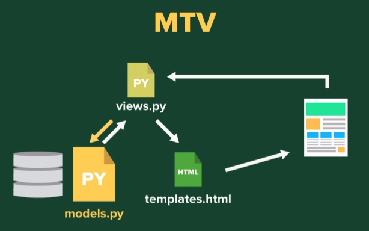

A **Model** é a camada de acesso dos dados. Nessa camada contém
as classes que abstraem os dados, as lógicas de validação, de
filtro e de acesso.

O **View** é a camada das regras de negócios. Nessa camada será
implementada as restrições, o que um usuário pode ou não pode
fazer, e quais páginas eles têm acesso. É através dessa camada
que as requisições do usuário serão gerenciadas.

Essa camada implementa algumas funções do Controller do padrão
MVC, porém o MTV se diferencia de MVC por ser mais permissivo
quanto a comunicação entre diferentes partes do software.

O **Template** é a camada de apresentação. Os templates são
arquivos de texto, que isola os dados do sistema da forma como
esses dados serão apresentados. O formato mais comum é o HTML.

## 2. Visão Geral

O sistema será desenvolvido utilizando o framework web Django Rest
em conjunto com o React.JS. Esses sistemas irão se comunicar através
de uma API REST fornecida pelo backend da aplicação.

## 3. Visão de implementação

### 3.1 Diagrama de classes e serviços geral

O diagrama de classe é uma representação estática para descrever
a arquitetura de um projeto. Tal documento tem como objetivo principal
documentar, de formar visual, as fases de desenvolvimento do software.
Ao analisar o diagrama abaixo é possível mapear, de forma clara e objetiva,
a estrutura do projeto em alto nível e auxiliar no entendimento
do escopo. Durante o processo de desenvolvimento do documento a Linguagem
de Modelagem Unificada (UML) foi utilizada.

#### 3.1.1 Diagrama de classes users

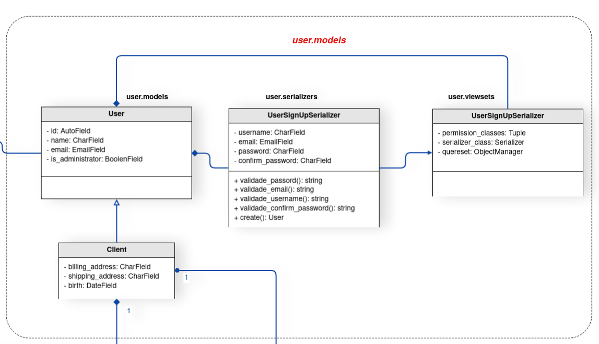

#### 3.1.2 Diagrama de classes products

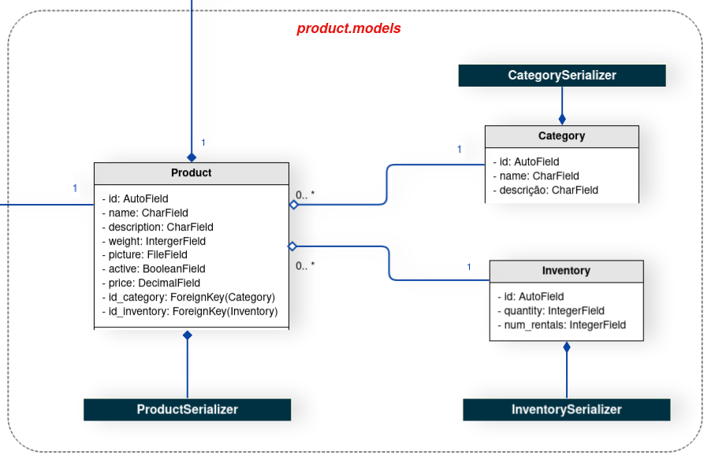

#### 3.1.3 Diagrama de classes shopping

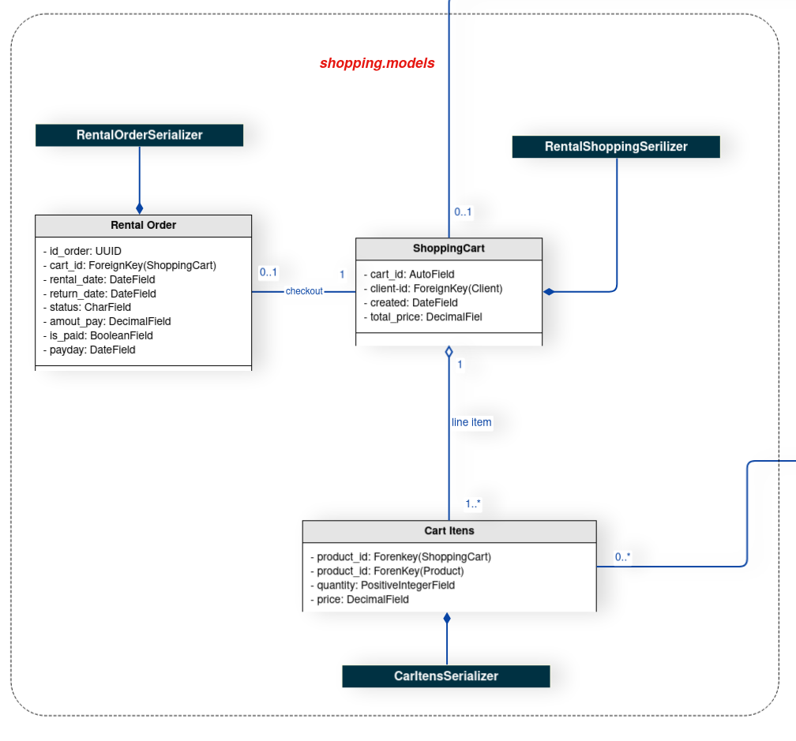

#### 3.1.4 Diagrama de classes review

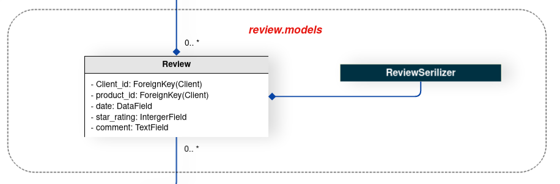

Vale ressaltar a existência de dois aspectos que influenciaram diretamente na
concepção do diagrama de classes, estas são as **relações do framework Django Rest**,
utilizadas para a serialização dos dados das classes, e o **padrão de design State**,
usado para designar diferentes comportamentos para o usuário da aplicação.

Sobre a classe de usuário da aplicação, o grupo de desenvolvimento do projeto
observou na model **User**, já implementada dentro do Django Rest Framework, uma
oportunidade de utilização de conteúdo pronto e adaptá-lo ao contexto do projeto.
Portanto, os usuários do aplicativo herdam da classe User do Django.

O padrão de design **State** surgiu como uma solução para o problema das diferentes
permissões, baseadas em diferentes papeis, que um usuário pode assumir dentro da
aplicação. Considerando que um mesmo usuário pode ser tanto um voluntário, quanto um
líder e em outro momento ter o comportamento de proprietário, a equipe passou a
enfrentar a problemática das permissões de um mesmo usuário. Desta forma, o State
soluciona esta problemática.

Os **serializers** presentes dentro do diagrama possuem a função de tratar as informações
das models e serializá-las, ou desserializá-las.

### 3.2 Banco de Dados

#### 3.2.1 Usos de diagramas entidade relacionamento

Para o desenvolvimento do diagrama do banco de dados foi escolhido o Diagrama Entidade Relacionamento (DER) é usado para modelar ou analisar banco de dados relacionais e resolver problemas de lógica ou implementação.

Foi projetado um Diagrama entidade-relacionamento (DER) que documenta tipos de entidades, tipos de relacionamento, tipos de atributos e cardinalidade e restrições fundamentais. O DER é um modelo de dados conceitual projetado com o objetivo de entender dados em um determinado domínio.

Primeiro foi identificado quais seriam as entidades envolvidas no projeto. Após identificadas, foi analisado qual os atributos necessários para descrever uma instância de cada uma das entidades.

 Para a construção do diagrama de componentes foi utilizado a ferramenta BRMODELO 

## 4. Visão de Processos

A visão de processo tem como objetivo mostrar a visão do modelo de projeto, dessa forma fornece uma base para compreender a organização do processo do sistema, uma visualização arquitetural denominada visualização do processo.

### 4.1 Diagrama de Sequência

Os diagramas de sequência enfatizam a ordenação temporal das mensagens. As interações são mostradas na ordem que elas ocorrem, ou seja, este tipo de diagrama mostra uma sequência de eventos. 

### Criar codigo de reserva

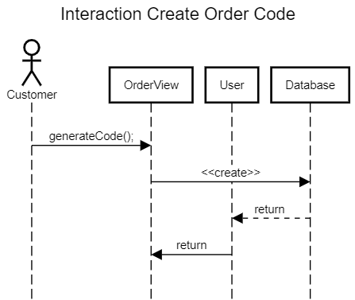

### Criar Produto

### Deletar Produto

### Atualizar Produto

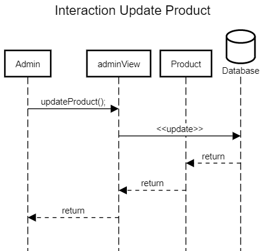

### Atualizar Reserva

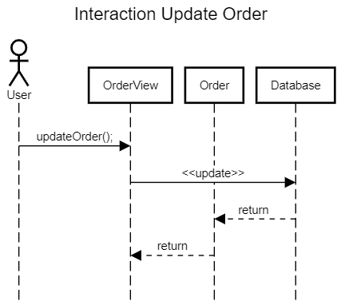

## 5. Visão Lógica

A visão lógica é a organização conceitual do software, que mostra um subconjunto do modelo de design significativo em termos de arquitetura, ou seja, um subconjunto das classes, subsistemas, pacotes e realizações de caso de uso.

### 5.1 Diagrama de Pacotes

Diagramas de pacotes são diagramas estruturais usados para mostrar, em uma forma de pacotes, a organização e disposição de vários elementos de modelos.

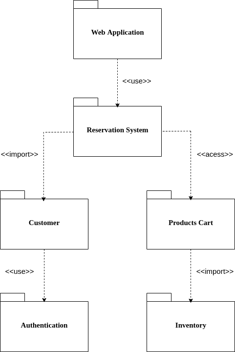

### 5.2 Diagrama de Comunicação

Um diagrama de comunicação, também chamado de diagrama de colaboração, é um tipo de diagrama UML de interação que demostra interações entre objetos e/ou partes, utilizando mensagens sequenciadas.

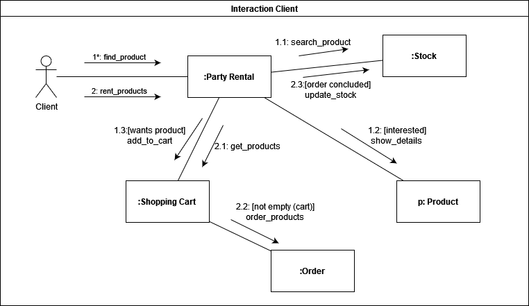

[Figura 1: Diagrama de comunicação de cliente](\modelagem\DiagramaComunicação\diagrama_comunicacao_1.png)

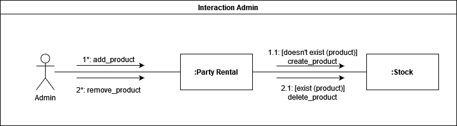

[Figura 2: Diagrama de comunicação de administrador](\modelagem\DiagramaComunicação\diagrama_comunicacao_2.png)

## 6. Qualidade

A qualidade de software pode ser interpretada como um conjunto de características a serem satisfeitas[5].

A Hewlett-Packard desenvolveu um modelo que referencia fatores da qualidade de software denominado FURPS: Functionality, Usability, Reliability, Performance e Supportability. Estes fatores estabelecem as métricas de qualidade de software para cada fase do processo de engenharia de software". (PRESSMAN, 2005, p. 539)

Alguns pontos de qualidade que podem ser observadas no projeto PartyRent são:

Portabilidade: No projeto foi utilizado o ambiente virtual Docker para garantir a portabilidade e criação de novos módulos do sistema.

Usabilidade: A interface é de fácil aprendizado, ou seja, é fácil para os usuários empregar uma ferramenta ou mesmo um objeto para realizar uma tarefa, por possuir padrões já conhecidos em e-commerce no mercado.

## Referências

> GITHUB.com. Padrões Arquiteturais MVC x Arquitetura do Django. Disponível em: <https://github.com/fga-gpp-mds/00-Disciplina/wiki/Padrões-Arquiteturais---MVC-X-Arquitetura-do-Django>. Acesso em: 21 de fevereiro de 2022.

> Andrew Pinkham. Livro. Disponível em: <https://django-unleashed.com>. Acesso em: 21 de fevereiro de 2022.

> O que é um diagrama entidade relacionamento?: <https://www.lucidchart.com/pages/pt/o-que-e-diagrama-entidade-relacionamento/#section_4>. Acesso em: 21 de fevereiro de 2022.

> DOCS.DJANGOPROJECT.com. FAQ: General. Disponível em: <https://docs.djangoproject.com/en/1.10/faq/general/#django-appears-to-be-a-mvc-framework-but-you-call-the-controller-the-view-and-the-view-the-template-how-come-you-don-t-use-the-standard-names>. Acesso em: 21 de fevereiro de 2022.

> Centro de Infomática UFPE.Disponivel em <https://www.cin.ufpe.br/>.Acesso em 17 de abril de 2022.
