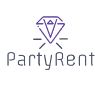

# Home

## Sobre o Projeto

A PartyRent é uma pequena empresa voltada a realização de aluguel para artigos diversos para festas. Mesas, cadeiras, móveis diversos e outros itens para a realização de aniversário, casamento, formaturas e demais eventos. A ideia do Projeto e realizar uma melhora no processo da empresa, realizando o desenvolvimento de uma ferramenta web para facilitar o processo de aluguel dos itens.

## Equipe

<table>
        <td align="center"><a href="https://github.com/CaioGabrielAraujo"> <b>Caio Gabriel</b></a> 
        <a href="https://github.com/flaviovl"> <b>Flavio Vieira</b></a> </td>
        <td align="center"><a href="https://github.com/JaimeJuan11"> <b>Jaime Damasceno</b></a> 
       <a href="https://github.com/jbisinotti"> <b>João Bisinotti</b></a> </td>
        <td align="center"><a href="https://github.com/luis-gustavo"> <b>Luis Avelino</b></a> 
        <a href="https://github.com/luisgfmarques"> <b>Luis Marques</b></a> </td>
        <td align="center"><a href="https://github.com/marcosgtavares"> <b>Marcos Tavares</b></a> 
        <a href="https://github.com/mateusbrandaot"> <b>Mateus Brandão</b></a> </td>
        <td align="center"><a href="https://github.com/matheusclemente"> <b>Matheus Clemente</b></a> 
       <a href="https://github.com/victor-rayan"> <b>Victor Rayan</b></a> </td>

</table>
