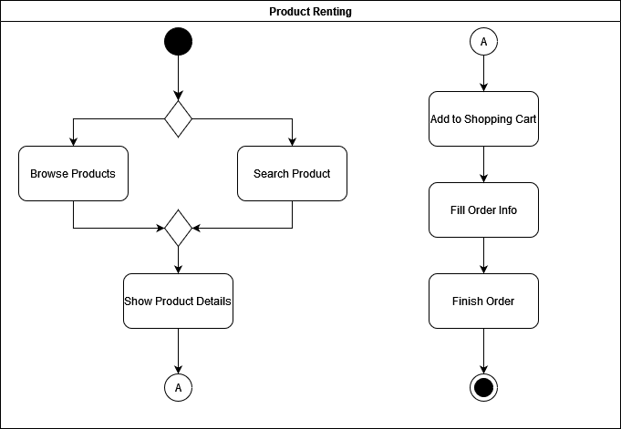
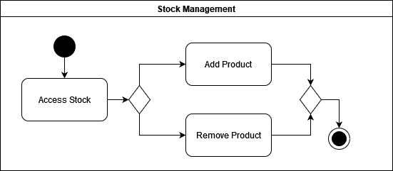

## Histórico de Versão

| Data       | Versão | Descrição                       | Autor(es)        |
| ---------- | ------ | ------------------------------- | ---------------- |
| 20/02/2022 | 1.0    | Criação do Documento e Diagramas| Matheus Clemente |

# Diagrama de Atividade

## 1. Introdução

Um diagrama de atividade é um diagrama UML de comportamento que mostra o fluxo de ações no projeto, com ênfase nas sequências e condições do fluxo.

## 2. Diagramas

A seguir são apresentados os diagramas de atividade elaborados com base na estrutura do projeto proposto, construídos utilizando a ferramenta on-line Diagrams.net.

Figura 1: Diagrama de ativivade de aluguel de produtos.

Figura 2: Diagrama de atividade de gestão de estoque.

## Referências
> "Activity Diagrams." Disponível em: https://www.uml-diagrams.org/activity-diagrams.html. Acesso em: 20 de fevereiro de 2022.