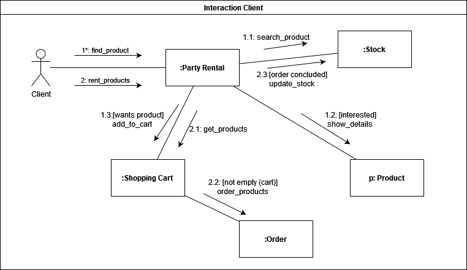

## Histórico de Versão

| Data       | Versão | Descrição                       | Autor(es)        |
| ---------- | ------ | ------------------------------- | ---------------- |
| 20/02/2022 | 1.0    | Criação do Documento e Diagramas| Matheus Clemente |

# Diagrama de Comunicação
## 1. Introdução

Um diagrama de comunicação, também chamado de diagrama de colaboração, é um tipo de diagrama UML de interação que demostra interações entre objetos e/ou partes, utilizando mensagens sequenciadas.

## 2. Diagramas

A seguir são apresentados os diagramas de comunicação elaborados com base na estrutura do projeto proposto, construídos utilizando a ferramenta on-line Diagrams.net.

Figura 1: Diagrama de comunicação de cliente.

Figura 2: Diagrama de comunicação de administrador.

## Referências
> "UML Communication Diagrams Overview." Disponível em: https://www.uml-diagrams.org/communication-diagrams.html. Acesso em: 20 de fevereiro de 2022.