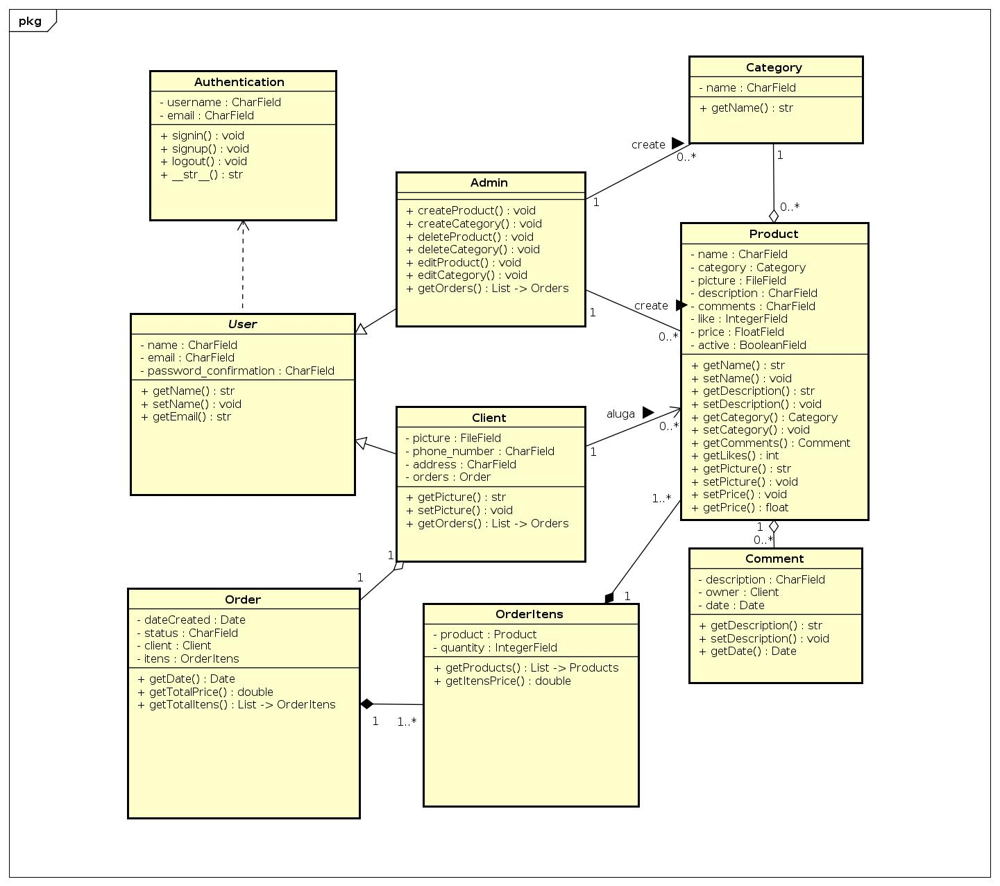
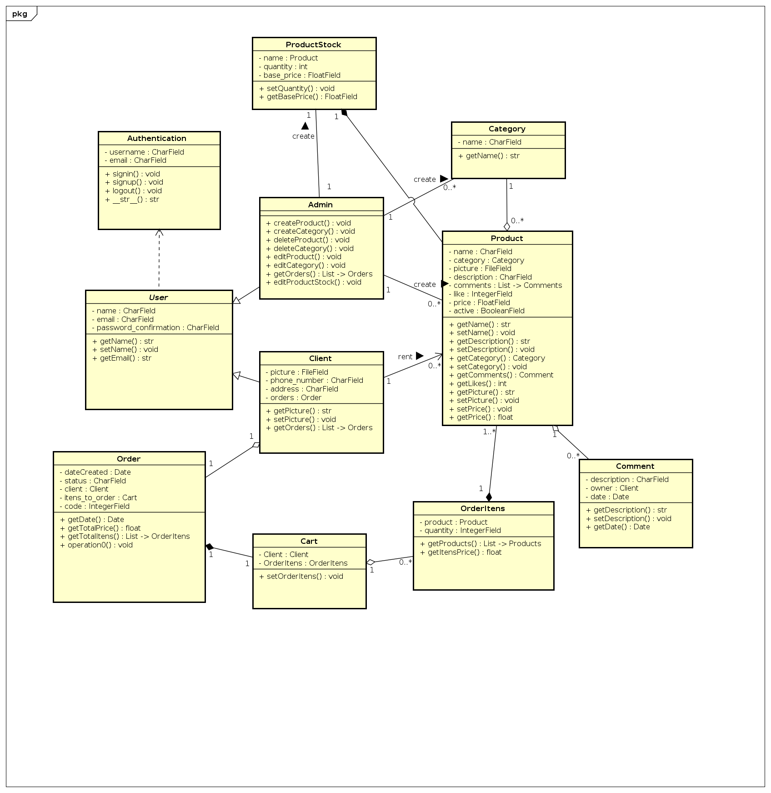

## Histórico de Versão

| Data       | Versão | Descrição                         | Autor(es)    |
| ---------- | ------ | --------------------------------- | ------------ |
| 16/02/2022 | 1.0    | Criação do Documento              | Caio Gabriel |
| 17/02/2022 | 1.1    | Atualização da Imagem             | Caio Gabriel |
| 17/02/2022 | 1.2    | Revisão do documento              | Caio Gabriel |
| 18/02/2022 | 1.3    | Adição da nova versão do diagrama | Caio Gabriel |
| 21/02/2022 | 1.4    | Revisão                           | Jaime Juan   |

# Diagrama de Classe

## Introdução

Primeiramente, um diagrama de classe como um diagrama estrutural estático. Seu desenvolvimento durante a criação de um produto é de extrema importância pois mostra a estruturação de um software baseada em classes, interfaces, restrições e relacionamentos e outros recursos.

O diagrama de classe fornece uma visão geral dos esquemas de um software. Não somente isso, mas também deixa claro as reais necessidades da aplicação de uma maneira intuitiva, não importando a complexidade do produto a ser implementado.

## Diagramas

### Versão 1.0

[Figura 1: Diagrama v1.0](diagrama_de_classes_3.jpg)

### Versão 2.0

[Figura 2: Diagrama v2.0](diagrama_de_classes_4.jpg)

## Referências

> UML - Class. Disponível em: [https://www.uml-diagrams.org/class.html](https://www.uml-diagrams.org/class.html). Data de acesso: 16/02/2022
>
> UML Class and Object Diagrams Overview. Disponível em:[https://www.uml-diagrams.org/class-diagrams-overview.html](https://www.uml-diagrams.org/class-diagrams-overview.html). Data de acesso: 17/02/2022
