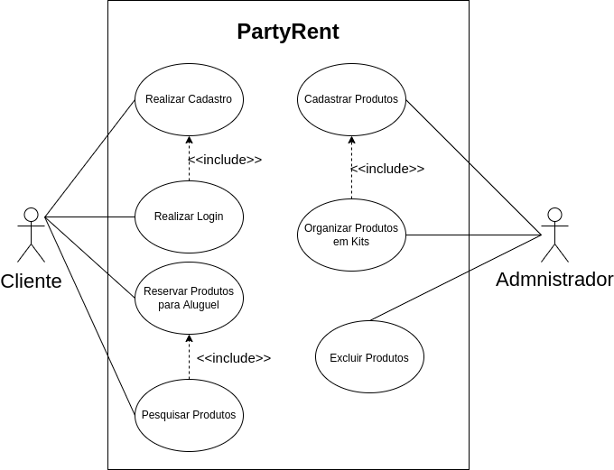

## Histórico de Versão

| Data       | Versão | Descrição                         | Autor(es)    |
| ---------- | ------ | --------------------------------- | ------------ |
| 21/02/2022 | 1.0    | Criação do Documento              | João Victor Max |
| 21/02/2022 | 1.1   | Revisão                           | Jaime Juan   |

# Diagrama de Casos de Uso
 
## Introdução

O diagrama de casos de uso descreve a funcionalidade proposta para um novo sistema que será projetado. Esse diagrama documenta o que o sistema faz do ponto de vista do usuário.

## Diagramas

### Versão 1.0

[Figura 1: Diagrama v1.0](diagrama_casos_de_uso1.png)

## Referências

> UML - Class. Disponível em: [https://www.lucidchart.com/pages/pt/diagrama-de-caso-de-uso-uml](https://www.lucidchart.com/pages/pt/diagrama-de-caso-de-uso-uml). Data de acesso: 21/02/2022