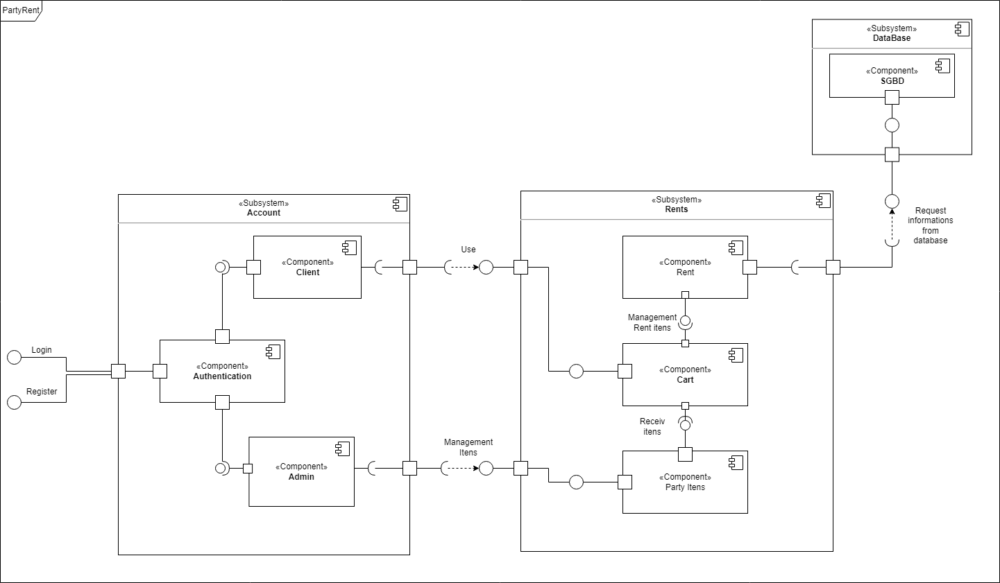

## Histórico de Versão

| Data       | Versão | Descrição                       | Autor(es)    |
| ---------- | ------ | ------------------------------- | ------------ |
| 18/02/2022 | 1.0    | Criação do documento            | Victor Rayan |
| 19/02/2022 | 1.1    | Adição do diagrama e conteúdo   | Victor Rayan |
| 21/02/2022 | 1.2    | Revisão                         | Jaime Juan   |
| 21/02/2022 | 1.3    | Alteração padrão de referências | Luis Marques |

# Diagrama de Componentes

## Introdução

O diagrama de componentes mostra o relacionamento entre diferentes componentes de um software. O diagrama ajuda a fornecer uma visualização de alto nível da estrutura física do sistema, além de enfatizar o comportamento de serviços quanto a interface. 

 Os diagramas de componentes vão permitir que a equipe identifique os diferentes componentes para que todo o sistema cumpra o seu objetivo. Contudo, o diagrama irá nos auxiliar na modularização do sistema permitirá a reutilização dos mesmos. Além disso, será possível :

<ul align="justify">
    <li>Imaginar a estrutura física do sistema.</li>
    <li>Prestar atenção aos componentes do sistema e como eles se relacionam.</li> 
    <li>Enfatiza o comportamento do serviço quanto à interface..</li> 
</ul>

 Para a construção do diagrama de componentes foi utilizado a ferramenta Draw.io 

<figcaption>Diagrama de componentes. Autor: Victor Rayan</figcaption>

## Referências

> UML Component Diagrams. disponível em <https://micreiros.com/diagramas-comportamentais-da-uml-diagrama-de-estados/> acessado em 20/02/2022.
> SERRANO, Milene. Diagrama de componentes, 2021. Material apresentado na Disciplina de Arquitetura e Desenho de Software do curso de engenharia de software da UnB, FGA
