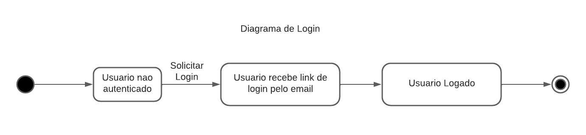
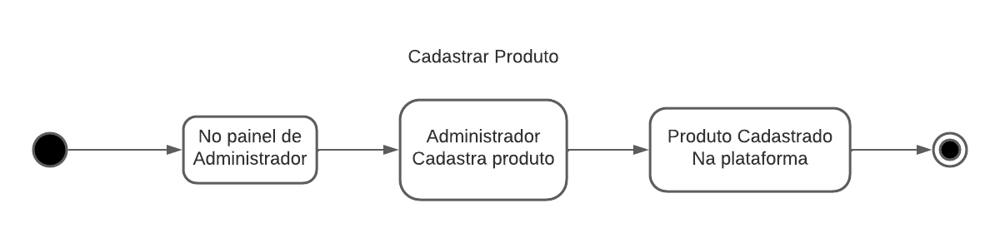

## Histórico de Versão

| Data       | Versão | Descrição            | Autor(es)    |
| ---------- | ------ | -------------------- | ------------ |
| 19/02/2022 | 1.0    | Criação do Documento | Luis Marques |
| 21/02/2022 | 1.1    | Revisão | Jaime Juan |

# Diagrama de Estados

## Introdução

O Diagrama de Estados é um dos diagramas pertencentes a Linguagem Unificada de Modelagem (UML), este diagrama mostra todos os estados possíveis que objetos de uma certa classe podem se encontrar e mostra também quais são os eventos do sistemas que provocam tais mudanças.

## Metodologia

Para realização dos diagramas foi utilizada a ferramente [LucidChart](https://www.lucidchart.com/pages/pt). A ferramenta e extremamente intuitiva e possui módulos para realização de gráficos UML e demais outros gráficos de produto de software.

## Diagramas

### Diagrama de Login

[Figura 1: Diagrama de Login](Diagrama_Login.png)

### Diagrama de Cadastro de Produto

[Figura 2: Diagrama de Cadastro de Produto](Diagrama_Produto.png)

### Diagrama de Reserva de Produto

[Figura 3: Diagrama de Reserva de Produto](Diagrama_Reserva.png)

## Referências

> Diagrama de Estados , Prof. Daniel D. Abdala <hhttp://www.facom.ufu.br/~abdala/DAS5312/Diagrama%20de%20Estados.pdf>. Acessado em 17/02/2022
>
> Diagramas Comportamentais da UML: Diagrama de Estados <https://micreiros.com/diagramas-comportamentais-da-uml-diagrama-de-estados/> acessado em 20/02/2022
