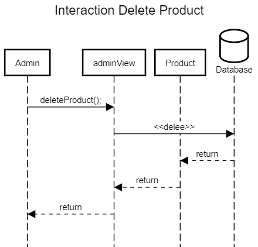

## Histórico de Versão

| Data       | Versão | Descrição                                                 | Autor(es)      |
| ---------- | ------ | --------------------------------------------------------- | ------------ |
| 20/02/2022 | 1.0    | Criação do documento                                      | Marcos Gabriel Tavares, Luis Gustavo Ferreira Marques |

# Diagrama de Sequência

## Introdução

Os Diagramas de sequência enfatiza a ordenação temporal das mensagens. As interações são mostradas na ordem que elas ocorrem, ou seja, este tipo de diagrama mostra uma sequencia de eventos. 

Para a construção dos diagramas de sequencias foi utilizada a ferramenta  [SequenceDiagram](https://sequencediagram.org/)
 
## Diagramas de sequência

### Criar codigo de reserva

[Figura 1: Interaction Create Order Code](sequencediagram1.png)

### Criar Produto

[Figura 2: Interaction Create Product](sequencediagram2.png)

### Deletar Produto

[Figura 3: Interaction Delete Product](sequencediagram3.png)

### Atualizar Produto

[Figura 4: Interaction Update Product](sequencediagram4.png)

### Atualizar Reserva

[Figura 5: Interaction Delete Product](sequencediagram5.png)

## Referências

 >Instructions and Examples. disponível em <https://sequencediagram.org/instructions.html>
 >
 >SERRANO, Milene. Diagrama de sequencia, 2022. Material apresentado na Disciplina de Arquitetura e Desenho de Software do curso de engenharia de software da UnB, FGA

