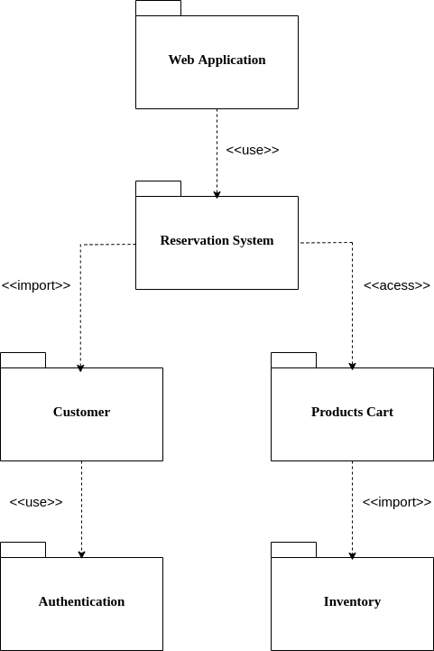

## Histórico de Versão

| Data       | Versão | Descrição            | Autor(es)       |
| ---------- | ------ | -------------------- | --------------- |
| 21/02/2022 | 1.0    | Criação do Documento | João Victor Max |
| 21/02/2022 | 1.1    | Revisão              | Jaime Juan      |

# Diagrama de Pacotes

## Introdução

Diagramas de pacotes são diagramas estruturais usados para mostrar, em uma forma de pacotes, a organização e disposição de vários elementos de modelos.

## Diagramas

### Versão 1.0

[Figura 1: Diagrama v1.0](diagrama_pacotes1.png)

## Referências

> UML - Class. Disponível em: [https://www.uml-diagrams.org/package-diagrams-overview.html](https://www.uml-diagrams.org/package-diagrams-overview.html). Data de acesso: 21/02/2022
