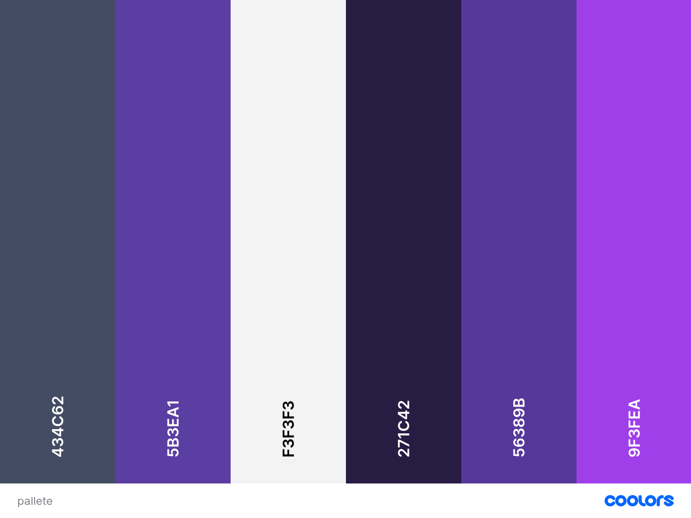

# Versionamento

| Data       | Versão | Descrição                                                 | Autores      |
| ---------- | ------ | --------------------------------------------------------- | ------------ |
| 14/01/2022 | 1.0    | Criação do documento e adição de conteúdo                 | Victor |

# Documento de Identidade Visual

## 1.Introdução

O documento de identidade visual tem o objetivo de listar os componentes visíveis na aplicação PartyRent, contendo nele tipografia, paleta de cores, logotipo e o protótipo de alta fidelidade.

## 2. Paleta de Cores

### &emsp; 2.1 Composição do corpo do site

 &emsp;A paleta de cores escolhida para o site apresenta uma variação de tonalidades predominantemente roxa, chamada Russian violet.

 
 

#### &emsp; 2.1.1 Código hexadecimal das cores
* Independece: #434C62
* Plump Purple 4: #5B3EA1
* Cultured: #F3F3F3
* Russian Violet: #271C42
* Rebecca Purple: #56389B

### &emsp; 2.2 Composição de cores da tipografia

#### &emsp; 2.2.1 Textos

 * **Títulos:** #131519.
 * **Textos:** #8190A5.
 * **Menus:** #FFFFFF.

#### &emsp; 2.2.2 Logotipo

 * **Letras:** #434C62.
 * **Resto da composição:** #5B3EA1.

## &ensp; 3. Logotipo

 &emsp;Foi escolhida para a logotipo uma composição básica de elementos, sendo apenas a palavra *PartyRent* na fonte *Offside*, com um ícone na cor Plump Purple.

 

## &ensp; 4. Tipografia

### &emsp; 4.1 Títulos

 Fonte | Tamanho | Espaçamento das linhas | Espaçamento das letras
 :--- | :---: | :---: | :---:
 Lato | 48px | 62px | 0px 
 Lato | 23px | auto | 0px 
 Lato | 26px | auto | 0px 

 ---

### &emsp; 4.2 Textos

 Fonte | Tamanho | Espaçamento das linhas | Espaçamento das letras
 :--- | :---: | :---: | :---:
 Lato | 18px | 28px | 0px

### &emsp; 4.3 Menus

 Fonte | Tamanho | Espaçamento das linhas | Espaçamento das letras
 :--- | :---: | :---: | :---:
 Lato | 24px | 62px | 0px

 ---

## &ensp; 5. Protótipo de alta fidelidade