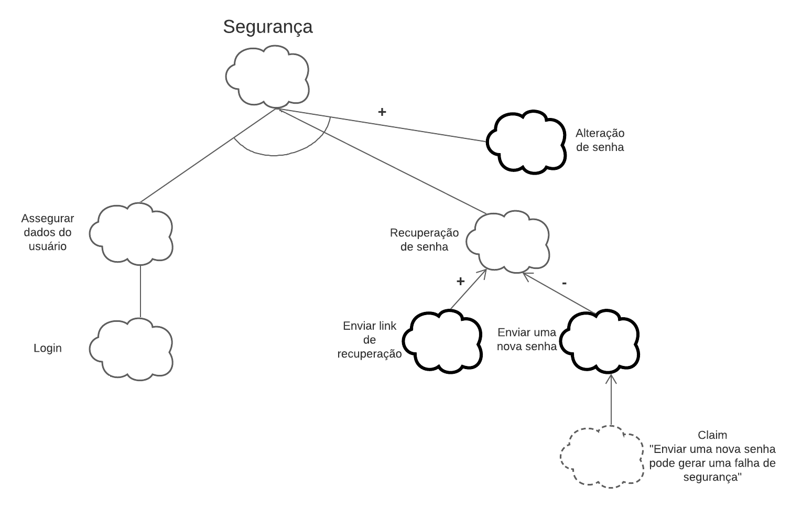

## Histórico de Versão

| Data       | Versão | Descrição            | Autor(es)    |
| ---------- | ------ | -------------------- | ------------ |
| 21/02/2022 | 1.0    | Criação do Documento | Jaime Juan |

# NFR

## 1. Introdução

A estrutura NFR foi proposta em 1992 e desenvolvida pelo Dr. Lawrence Chung em 1999. Em suas palavras, NFR é "uma abordagem orientada a processos em que os requisitos não funcionais são explicitamente expressos como metas a serem alcançadas" [CHUNG, 1995]. Utiliza-se o modelo GIS (Softgoal Interdependency Graph), que descreve as dependências entre softgoals e como elas são decompostas. 

## 2. Metodologia

Para a produção do NFR foi utilizado a ferramenta [Draw.io](https://app.diagrams.net/).

* Legenda: 
  

[Figura 1: Legenda](legenda-nfrf.png)

## 3. NFRs 

### 3.1. NFR Segurança

[Figura 2: NFR Segurança](nfr-seguranca.png)

### 3.2. NFR Usabilidade

[Figura 3: NFR Usabilidade](nfr-usabilidade.png)

### 3.3. NFR Performance

[Figura 4: NFR Perfomance](nfr-performance.png)

### 3.4. NFR Manutenibilidade

[Figura 5: NFR Manutenibilidade](NFR-Manutenibilidade.png)

### 3.5. NFR Portabilidade

[Figura 7: NFR Portabilidade](nfr-portabilidade.png)

## Referências

> NFR Framework. Disponível em: http://docplayer.com.br/60853971-Engenharia-de-software-docente-eng-a-isabel-sofia-brito-discentes-jose-janeiro-ei2467-joaquim-gomes-ei4349.html. Acesso em: 21 de fevereiro de 2022.
