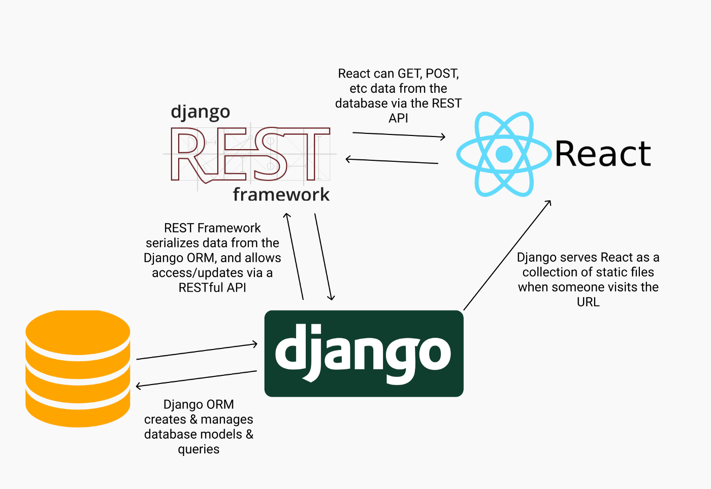
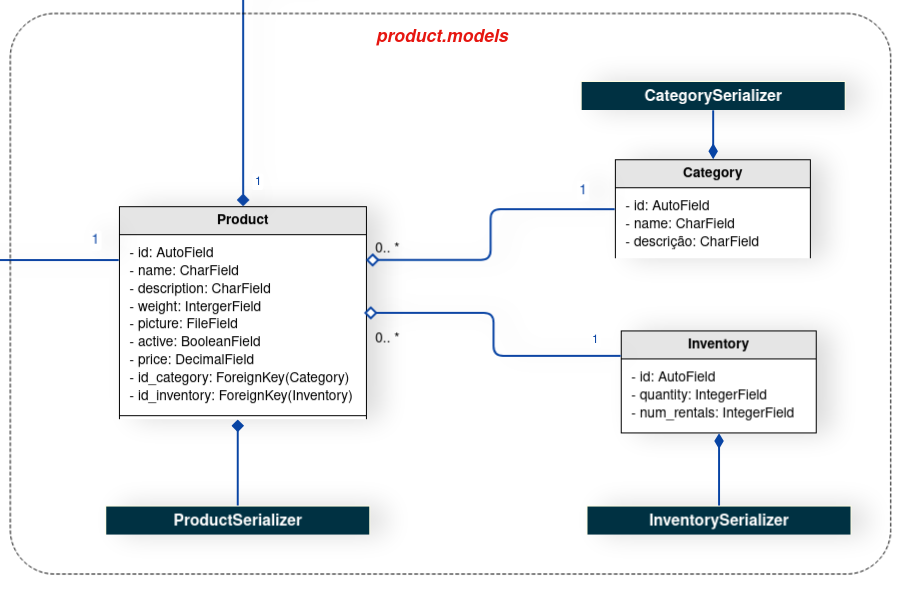

# DAS

## Histórico de revisão
| Data   | Versão | Modificação  | Autor  |
| :- | :- | :- | :- |
| 19/03/2022 | 0.1 | Adição da estrutura documento |  Flavio Vieira |
| 20/03/2022 | 0.2 | Adicão Introdução e principais conceitos|  Flavio Vieira |
| 20/03/2022 | 0.2 | Adição de Visão de implementação e diagramas de classe|  Flavio Vieira |
| 20/03/2022 | 0.2 | Adição do diagram ER de banco de dados|  Flavio Vieira |

## 1. Introdução

### 1.1 Objetivo
Este documento oferece uma visão geral arquitetural do 
sistema que será implementado, permitindo assim que os 
envolvidos no projeto conheçam como a aplicação será 
subdivida e quais serão as funções de cada componente.

### 1.2 Django REST Framework

O Django REST Framework é uma biblioteca para o Framework 
Django que disponibiliza funcionalidades para implementar 
APIs Rest de forma rápida e eficiente.

REST é a abreviação do termo <i>Representational State 
Transfer</i>, isto é, um conjunto de princípios e boas 
práticas desenvolvido pelo pesquisador Roy Fielding, que 
quando aplicados permitem uma interface concisa que pode 
ser utilizada por diversas outras aplicações.

### 1.3 Modelo MTV

A **Model** é a camada de acesso dos dados. Nessa camada contém 
as classes que abstraem os dados, as lógicas de validação, de 
filtro e de acesso.

O **View** é a camada das regras de negócios. Nessa camada será 
implementada as restrições, o que um usuário pode ou não pode 
fazer, e quais páginas eles têm acesso. É através dessa camada 
que as requisições do usuário serão gerenciadas.

Essa camada implementa algumas funções do Controller do padrão 
MVC, porém o MTV se diferencia de MVC por ser mais permissivo
quanto a comunicação entre diferentes partes do software.

O **Template** é a camada de apresentação. Os templates são 
arquivos de texto, que isola os dados do sistema da forma como 
esses dados serão apresentados. O formato mais comum é o HTML.

### 1.4 Django REST
Assim contextualizado, podemos falar sobre o Django REST.
O Django REST possui diversos módulos embutidos que 
facilitam a implementação dos princípios e boas práticas 
da arquitetura REST. 

Um exemplo de facilidade é o fato de que por padrão as rotas 
dos recursos selecionados serem codificadas para 
respeitar o padrão da arquitetura REST, assim não sendo 
necessário escrever todas as 7 rotas do REST (index, new, 
create, show, edit, update e destroy).

## 2. Visão Geral

O sistema será desenvolvido utilizando o framework web Django Rest 
em conjunto com o React.JS. Esses sistemas irão se comunicar através 
de uma API REST fornecida pelo backend da aplicação.

## 2. Visão de implementação
### 2.1 Diagrama de classes e serviços geral

O diagrama de classe é uma representação estática para descrever 
a arquitetura de um projeto. Tal documento tem como objetivo principal 
documentar, de formar visual, as fases de desenvolvimento do software. 
Ao analisar o diagrama abaixo é possível mapear, de forma clara e objetiva, 
a estrutura do projeto em alto nível e auxiliar no entendimento
do escopo. Durante o processo de desenvolvimento do documento a Linguagem 
de Modelagem Unificada (UML) foi utilizada. 

### 2.1.1 Diagrama de classes users

### 2.1.2 Diagrama de classes products

    

### 2.1.3 Diagrama de classes shopping

### 2.1.4 Diagrama de classes review

Vale ressaltar a existência de dois aspectos que influenciaram diretamente na
concepção do diagrama de classes, estas são as **relações do framework Django Rest**,
utilizadas para a serialização dos dados das classes, e o **padrão de design State**,
usado para designar diferentes comportamentos para o usuário da aplicação.

Sobre a classe de usuário da aplicação, o grupo de desenvolvimento do projeto
observou na model **User**, já implementada dentro do Django Rest Framework, uma 
oportunidade de utilização de conteúdo pronto e adaptá-lo ao contexto do projeto.
Portanto, os usuários do aplicativo herdam da classe User do Django.

O padrão de design **State** surgiu como uma solução para o problema das diferentes
permissões, baseadas em diferentes papeis, que um usuário pode assumir dentro da 
aplicação. Considerando que um mesmo usuário pode ser tanto um voluntário, quanto um 
líder e em outro momento ter o comportamento de proprietário, a equipe passou a 
enfrentar a problemática das permissões de um mesmo usuário. Desta forma, o State
soluciona esta problemática.

Os **serializers** presentes dentro do diagrama possuem a função de tratar as informações
das models e serializá-las, ou desserializá-las.

## 2.2 Banco de Dados

### 2.2.1 Usos de diagramas entidade relacionamento

Para o desenvolvimento do diagrama do banco de dados foi escolhido o Diagrama Entidade Relacionamento (DER) é usado para modelar ou analisar banco de dados relacionais e resolver problemas de lógica ou implementação.

Foi projetado um Diagrama entidade-relacionamento (DER) que documenta tipos de entidades, tipos de relacionamento, tipos de atributos e cardinalidade e restrições fundamentais. O DER é um modelo de dados conceitual projetado com o objetivo de entender dados em um determinado domínio.

Primeiro foi identificado quais seriam as entidades envolvidas no projeto. Após identificadas, foi analisado qual os atributos necessários para descrever uma instância de cada uma das entidades.

 Para a construção do diagrama de componentes foi utilizado a ferramenta BRMODELO 

## Referências

> GITHUB.com. Padrões Arquiteturais MVC x Arquitetura do Django. Disponível em: <https://github.com/fga-gpp-mds/00-Disciplina/wiki/Padrões-Arquiteturais---MVC-X-Arquitetura-do-Django>. Acesso em: 21 de fevereiro de 2022.

> Andrew Pinkham. Livro. Disponível em: <https://django-unleashed.com>. Acesso em: 21 de fevereiro de 2022.

> O que é um diagrama entidade relacionamento?: <https://www.lucidchart.com/pages/pt/o-que-e-diagrama-entidade-relacionamento/#section_4>. Acesso em: 21 de fevereiro de 2022.

> DOCS.DJANGOPROJECT.com. FAQ: General. Disponível em: <https://docs.djangoproject.com/en/1.10/faq/general/#django-appears-to-be-a-mvc-framework-but-you-call-the-controller-the-view-and-the-view-the-template-how-come-you-don-t-use-the-standard-names>. Acesso em: 21 de fevereiro de 2022.