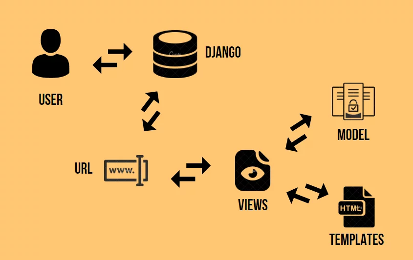

## Histórico de Versão

| Data       | Versão | Descrição                                                 | Autor(es)      |
| ---------- | ------ | --------------------------------------------------------- | ------------ |
| 10/03/2022 | 1.0    | Criação do documento                                      | Marcos Gabriel Tavares|
| 10/03/2022 | 1.1    | Adição do padrão MVT e atualização das referências        | Marcos Gabriel Tavares|

# Padrões de projeto emergentes
## Introdução
Padrões de projeto, tambem conhecidos como design patterns, são soluções generalistas para problemas recorrentes durante um desenvolvimento de um software, é uma definição alto nivel de como o problema pode ser solucionado. Alguns padrões emergentes que pretendemos utilizar no desenvolvimento do PartyRent são:

 - MVT

## MVT
MVT é um padrao utilizado pelo Django e sua sigla significa Model, View, Template. Model fornece a interface para os dados armazenados no Banco de Dados e é responsável por manter os dados e manipular a estrutura lógica de dados para todo o aplicativo. Views agem como a conecção entre os dados dos Models e os Templates, elas veem a requisição do usuario, recolhem os dados apropriados do banco de dados e renderiza a template novamente com os dados atualizados. Templates são responsáveis por toda a interface do usuário e lida com todas as partes estáticas da página juntamente com o HTML que os usuários que visitam a página visualizarão.   

## Referências
-   Design Patterns – O que são e quais os benefícios?:  [https://www.opus-software.com.br/design-patterns/](https://www.opus-software.com.br/design-patterns/). Último acesso em 10/03/2022.

- Django MVT Architecture: [https://www.askpython.com/django/django-mvt-architecture](https://www.askpython.com/django/django-mvt-architecture). Último acesso em 10/03/2022.

- Python Django 7 Hour Course: [https://www.youtube.com/watch?v=PtQiiknWUcI](https://www.youtube.com/watch?v=PtQiiknWUcI). Último acesso em 10/03/2022.
