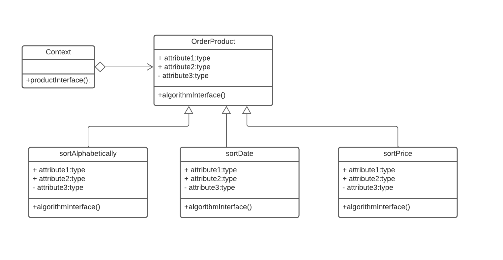
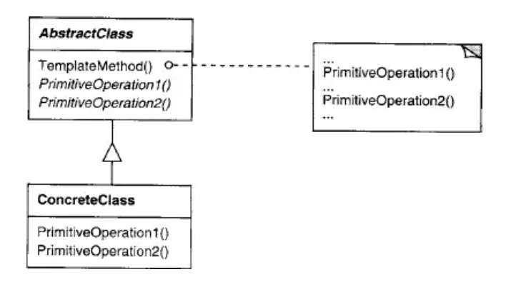
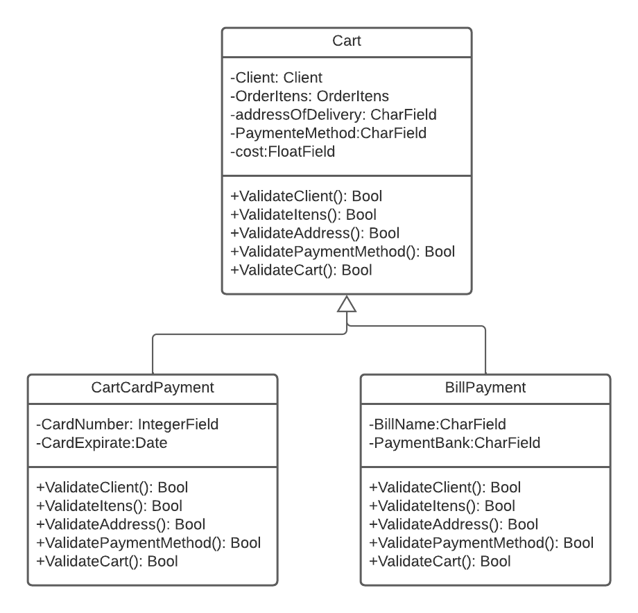

# Histórico de Versão

| Data       | Versão | Descrição                   | Autor(es)    |
| ---------- | ------ | --------------------------- | ------------ |
| 07/03/2022 | 1.0    | Criação do documento        | Victor       |
| 14/03/2022 | 2.0    | Adicionando exemplo         | Victor       |
| 14/03/2022 | 3.0    | Adicionando Template Method | Luis Marques |

# GOFs Comportamentais

Os GoFs comportamentais são padrões de projetos mais voltados para alterações no nível do comportamento dos objetos.
Eles auxiliam principalmente quando são utilizados vários algoritmos diferentes.

## Metodologia

Para construção do diagrama do Template Method é do Strategy, foi utilizado a ferramenta lucidchart, utilizando como modelo para confecção os diagramas apresentados em aula pela professora Milene Serrano. Para exemplificação em código foi criado um exemplo exemplo-TOY de aplicação do projeto para cada GOF exemplificada.

## Strategy

O Strategy é um dos principais Gofs Comportamentais, que permite de maneira simples, variar dos algoritmos utilizados e resolver um certo problema.

O Strategy propõe uma solução que possibilita a variação facilitada do algoritmo a ser utilizado.
Um exemplo seria utilizar um função em python que é passada como parâmetro para um outro método.

O padrão de projeto strategy sugere que todos os algoritmos centralizados nesta classe sejam separados em outras classes.

### Quando usar?

É indicado usar, quando é necessário vários algoritmos com diferentes variações.
Além disso, quando existem declarações condicionais em torno de vários algoritmos relacionados. E por fim, quando muitas 'Classes' tem comportamento relacionado.

Exemplo do diagrama UML deste padrão, que pode ser aplicado no projeto:



Exemplo de implementação em Python, que pode ser aplicado no projeto:

```python

from Calculator_de_impostos(object):
    def realiza_calculo(self, orcamento, imposto):

        imposto_calculado = imposto.calcula(orcamento)

        printf imposto_calculado

if __name__ == '__main__':

   from orcamento import Orcamento

   calculator = Calculator_de_impostos()

   orcamento = Orcamento(350)

   calculator.realiza_calculo(orcamento, ISS().calcula)
   calculator.realiza_calculo(orcamento, IOMS().calcula)

```

```python
class ISS(object):

    def calcula(self, orcamento):

        return orcamento.valor = 0.1

class ICMS(object):

    def calcula(self, orcamento):

        return orcamento.valor = 0.065

```

<center> 
Exemplo 1: Strategy implementada em python, aplicada no projeto.
</center>

Vantagens:

-   Reutilização de código
-   Manutenibilidade do código;
-   É fácil alternar entre diferentes algoritmos (estratégias) em tempo de execução.
-   Código limpo, pois se evita o código com excesso de estruturas condicionais.

Desvantagens:

-   Aumento do número de classes do projeto.
-   Aumento do número de objetos.

## Template Method

O Template Method e um padrão de GOF comportamental onde a ordem dos métodos nao deve ser alterada,seguindo o template da classe mãe nas filhas, mesmo que o método em si seja alterado. Com isso em mente a ideia central por trás do template method, como o próprio nome sugere , e a criação de um template padrão(normalmente feito de forma abstrata) para a manutenção da ordem de execução dos métodos, não importando como estes métodos funcionam internamente.

### Template Method Estrutura

<center>[Figura 1. Template Method Estrutura](imagens/Template_Method-estrutura.png)
</center>

<center>Fonte:GAMMA, Erich(2007, p.302)</center>

Como exemplo da estrutura básica usada temos a estrutura mostrada acima. onde existe uma AbstractClass, que contem os templates de método é a ordem dos operadores que serão executadas, é a classe ConcreteClass que herda da classe Abstrata, é por sua vez efetua alteração nos métodos primitiveOperation, sem realizar alteração em sua ordem de execução.

### Template Method Aplicação.

#### 1.Modelagem

Para um exemplo de aplicação no contexto do projeto foi realizada a criação de uma nova classe Cart, que sera criada a partir do diagrama de classe, implementando novos métodos que antes não estavam incluídos no projeto original.

<center>[Figura 1. Template Method Exemplo](imagens/Template_Method_Example.png)</center>


#### 2.Exemplo em Código

Para Aplicação do Template Method foi criado um código em python, tentando exemplificar ao máximo o programação orientada a objeto utilizando um mesmo arquivo. Utilizando um sistema de pagamento somente simplificado, pois seria necessário o cadastro em algumas plataformas para correto funcionamento da API de pagamentos.

#### 2.1 Codigo fonte

```python
from cieloApi3 import *

import json

environment = Environment(sandbox=True)


class Cart():
    def __init__(self,id,Client,OrderItens,addressOfDelivery,PaymentMethod,cost):
        self.id = id
        self.Client = Client
        self.OrderItens = OrderItens
        self.addressOfDelivery = addressOfDelivery
        self.PaymentMethod = PaymentMethod
        self.cost = cost
    def ValidateClient(self):
        if(self.Client != None):
            return True
        else:
            return False
    def ValidateItens(self):
        if(self.OrderItens != None):
            return True
        else:
            return False
    def ValidateAddress(self):
        if(self.Address != None):
            return True
        else:
            return False
    def ValidatePaymentMethod(self):
        ## Implementação posterior
        return None
    def ValidateCart(self):
        if(self.ValidateClient() and self.ValidateItens() and self.ValidateAddress() and self.ValidatePaymentMethod() and self.ValidateCart()):
            return True
        else:
            return False

class CartCardPayment(Cart):
    def __init__(self,id,Client,OrderItens,addressOfDelivery,PaymentMethod,cost,CardNumber,CardExpirate,CardName):
        super().__init__(id,Client,OrderItens,addressOfDelivery,PaymentMethod,cost)
        self.CardNumber = CardNumber
        self.CardExpirate = CardExpirate
    def ValidateClient(self):
        super().ValidateClient()
    def ValidateItens(self):
        super().ValidateItens()
    def ValidateAddress(self):
        super().ValidateAddress()
    def ValidatePaymentMethod():
        if(super.PaymentMethod == "Card"):
            idnum = self.id
            credit_card = CreditCard(id, 'Visa')
            credit_card.expiration_date = CardEpirate
            credit_card.card_number = CardNumber
            credit_card.holder = CardName
            sale = Sale(self.id)
            sale.customer = Customer(self.CardName)
            sale.payment = Payment(self.cost)
            sale.payment.credit_card = credit_card
            response_create_sale = cielo_ecommerce.create_sale(sale)
            payment_id = sale.payment.payment_id
            if(payment_id != None):
                return True
            else:
                return False
        else:
            return False

    def ValidateCart():
        return super().ValidateCart()


class BillPayment(Cart):
    def __init__(self,id,Client,OrderItens,addressOfDelivery,PaymentMethod,cost,BillName,PaymentBank):
        super().__init__(id,Client,OrderItens,addressOfDelivery,PaymentMethod,cost)
        self.BillName = BillName
        self.PaymentBank = PaymentBank
    def ValidateClient(self):
        super().ValidateClient()
    def ValidateItens(self):
        super().ValidateItens()
    def ValidateAddress(self):
        super().ValidateAddress()
    def ValidatePaymentMethod():
        if(super.PaymentMethod == "BILL"):
            idnum = self.id
            sale = Sale(self.id)
            sale.customer = Customer(self.CardName)
            sale.payment = Payment(self.cost)
            sale.payment.provider = (self.PaymentBank)
            response_create_sale = cielo_ecommerce.create_sale(sale)
            payment_id = sale.payment.payment_id
            if(payment_id != None):
                return True
            else:
                return False
        else:
            return False

    def ValidateCart():
        return super().ValidateCart()
```

<center> 
Exemplo 2: Template Method implementada em python, aplicada no projeto.
</center>

### Referências

> SERRANO, Milene. Arquitetura e Desenho de Software: Aula GoFs Comportamentais, disponível em: aprender3.unb

> DevMedia. Estudo e Aplicação do Padrão de Projeto Strategy Disponível em: https://www.devmedia.com.br/estudo-e-aplicacao-do-padrao-de-projeto-strategy/25856.

> DevMedia. Design Patterns: Padrões “GoF” Disponível em https://www.devmedia.com.br/design-patterns-padroes-gof/16781

> GAMMA, Erich; HELM, Richard; JOHNSON, Ralph; VLISSIDES, John. Padrões de Projeto: Soluções reutilizáveis de software orientado a objetos. Porto Alegre: Bookman, 2007.

> API-3.0-Python disponível em: [API-3.0-Python](https://github.com/DeveloperCielo/API-3.0-Python#readme) (último acesso: dia 14 de março de 2022).
