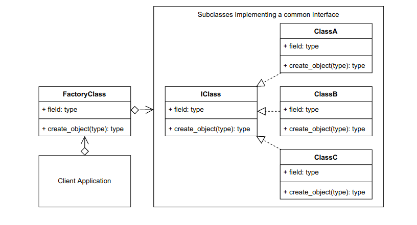
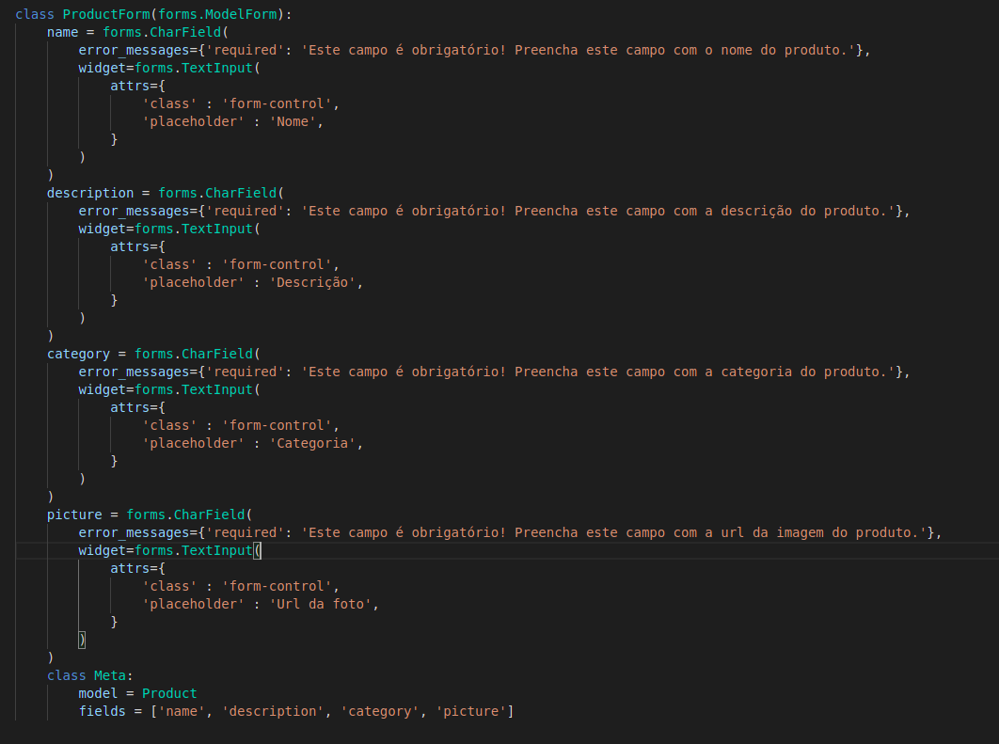
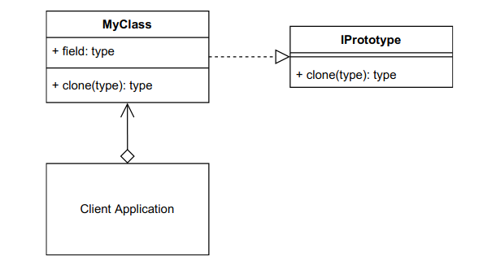
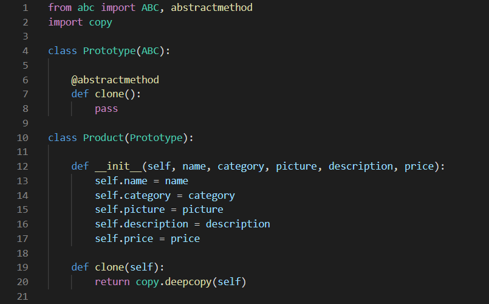

## Histórico de Versão

| Data       | Versão | Descrição                  | Autor(es)        |
| ---------- | ------ | -------------------------- | ---------------- |
| 07/03/2022 | 1.0    | Criação do documento base  | Matheus Clemente |
| 08/03/2022 | 1.1    | Criação da Introdução      | Caio Gabriel     |
| 08/03/2022 | 1.2    | Factory e Prototype        | Caio Gabriel     |
| 10/03/2022 | 1.3    | Aplicação Prototype e referências | Matheus Clemente |
| 13/03/2022 | 1.4    | Aplicação Factory Method | Caio Gabriel |
| 18/03/2022 | 1.5    | Refatoração Factory Method | Caio Gabriel |

# GOFs Criacionais

## Factory Method

Quando estamos realizando a implementação de um código, normalmente os objetos são instâciados diretamente pelas classes implementadas. 
Apesar disso parecer mais usual, algumas implementações necessitam de um nível maior de abstração de acordo com o escopo do produto. 
Desse modo, o padrão *Factory* pode ajudar quanto a este tipo de abstração, pois, além de ser de fácil entendimento, esse tipo de instância
pode ser criado fora da classe ou método. Assim, seguindo o padrão, é melhor definir uma interface para a criação de objetos e deixar para
a subclasse em questão, a decisão de qual classe instanciar. Seguindo somente a teoria, isso pode parecer complexo, mas após a implementação
deste tipo de padrão, essa separação torna o código escrito mais fácil de se entender e mais documentável. 

### Modelagem

### Aplicação

 O projeto PartyRental_backend está utilizando como tecnologia Django Rest API, e ela possui um módulo chamado Forms no qual ela é responsável por definir os campos necessários para que seja construido um objeto deste tipo. Este Forms em específico é responsável por definir quais os campos de entrada para que posteriormente seja instanciação um objeto do tipo Produto. Logo após a definição das classes do tipo form, a classe meta irá definir inicialmente a modelo, que sera utilizada na construção do formulario, e logo após serão definidos os fields que compões os dados necessários para a construção deste objeto.

## Prototype

O padrão de projeto *Prototype* tem como premissa criar um objeto, no qual, irá ser a cópia de um objeto existente. Isso permite com que a 
implementação utilize a cópia de um objeto utilizável, com variáveis já pré-definidas com um valor significativo atribuido para cada replicação em 
questão, em vez de depender de algum estado inicial definido no construtor do objeto. De acordo com Sean Bradley, na interface de protótipo,
é necessário criar um método clone estático que deve ser implementado por todas as classes que usam a interface. Como o método cópia vai ser
implementado na classe concreta, fica inteiramente a critério do desenvolvedor.

### Modelagem

### Aplicação

O padrão Prototype pode ser utilizado em nosso projeto no instanciamento de produtos, permitindo que apenas um objeto seja instanciado e, a partir dele, outros sejam clonados e modificados para suprir as necessidades do programa.

### Referências
> BRADLEY, Sean. Design Patterns In Python: Common GoF (Gang of Four) Design Patterns Implemented In Python. 2019-2021 - Data de acesso: 07/03/2022
