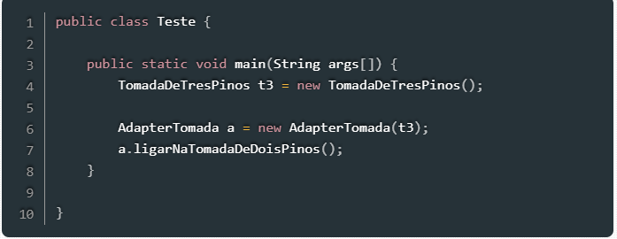
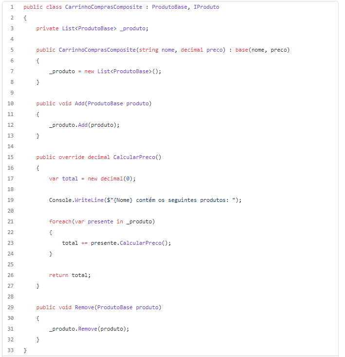
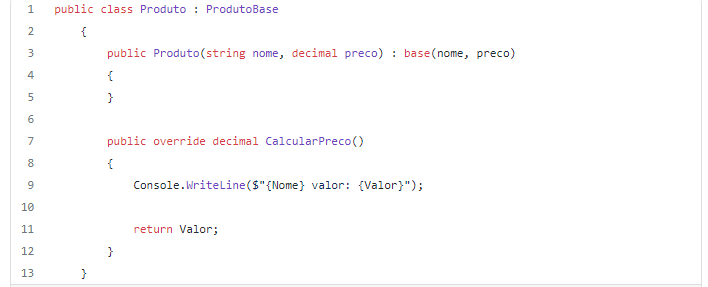
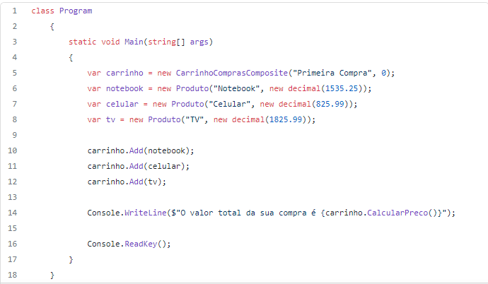

## Histórico de Versão

| Data | Versão | Descrição | Autores |
| -------- | -------- | -------- | ---|
| 07/03/2022     |  1.0  | Criação do documento  | Mateus Brandão Teixeira, João Victor Max
| 10/03/2022     |  1.0  | incluindo padrão Composite | Mateus Brandão Teixeira
 10/03/2022     |  1.0  | incluindo código Composite | Mateus Brandão Teixeira
  10/03/2022     |  1.0  | Padronizando documento | João Victor Max

Os padrões estruturais se preocupam com a forma como classes e objetos são compostos para formar estruturas maiores. Os de classes utilizam a herança para compor interfaces ou implementações, e os de objeto ao invés de compor interfaces ou implementações, eles descrevem maneiras de compor objetos para obter novas funcionalidades. A flexibilidade obtida pela composição de objetos provém da capacidade de mudar a composição em tempo de execução o que não é possível com a composição estática (herança de classes).

# GOFs Estruturais

# Adapter 
O Adapter é um padrão bem simples de compreender,sendo sua principal funcionalidade converter a interface de uma classe para outra interface que o cliente já espera receber.Trazendo para o mundo real podemos usar um exemplo que ocorreu na construção civil quando o governo padronizou o uso de tomadas,com isso as contruções eram entregues com esse novo padrão,porém muitos de nossos aparelhos, fabricados antes da definição do novo padrão, não eram mais compatíveis com essas tomadas.Com isso,foi necessário o uso de adaptadores para permitir a utilização de aparelhos antigos nas tomadas com o novo padrão.Entrando no mundo computacional O padrão de adaptador geralmente é usado quando precisamos instalar uma nova biblioteca de classes adquirida de um fornecedor em um sistema de software existente, mas essas novas bibliotecas de classes de fornecedores não são as mesmas que as bibliotecas de classes antigas de fornecedores. Como não temos o código do novo fornecedor e não podemos alterá-lo, podemos criar uma classe para fazer essa adaptação, que é responsável por adaptar a interface do novo fornecedor ao que o sistema espera. Adaptadores são amplamente utilizados para tornar seu sistema compatível com outros frameworks ou APIs.

# Aplicando o Adapter

Normalmente o cliente faz uma chamada usando a tomada de dois pinos,porém surge a necessidade de fazer chamadas de três pinos e para isso ser possível é necessário a implementação de uma classe adpater.Assim temos duas interfaces que não eram compatíveis entre si conversando normalmente.

# É possível adaptar a nossa forma de organização de projeto com este padrão?
Sim no futuro existe grande possibilidade de termos que utilizar esse padrão,pois os softwares sempre estão em constate evolução.Isso se deve a necessidade de sempre ajustar e melhorar o produto.Portanto é bem provável que em realeses para melhorias seja necessário utilizar o adapter.

# Composite
É possível usar o padrão composite quando o modelo central da aplicação pode ser representado como uma árvore.Se trantando de orientação a objetos,isso significa aplicarmos o polimorfismo para chamar métodos de um objeto na árvore sem nos preocuparmos se é uma folha(objetos individuais) ou um composto(grupos de objetos).Resumindo a intenção do padrão é comor objetos em estruturas de árvore para representar hierarquia partes-todo.
Podemos aplicar o Composite quando queremos trabalhar uma hierarquia de objetos que representem uma mesma super-classe,de modo a tornar sua operação padronizada,podemos exemplficar através da elaboração de um sistema de arquivos que são dividios em arquivos concretos(vídeos,textos,etc.) e arquivos pastas que armazenam outros arquivos.O problema é como fazer um desing que atenda estes requisitos?Por meio do padrão Composite,todos terão uma forma comum de serem reconhecidos e trabalhados ,através de uma super-classe.

# É possível adaptar a nossa forma de organização de projeto com este padrão?
Sim,nossa aplicação terá um carrinho com os produtos que serão reservados.A partir disso surge a necessidade de calcular o preço total de um carrinho de compras ou de um único produto da nossa loja,portanto podemos utilizar uma estrtura de árvore para representar o carrinho de reservas da loja.

# Exemplificando como usar o composite no carrinho com o c#
Então, vamos começar com a classe de ProdutoBase:

Nossa classe consiste em dois campos protegidos e um método abstrato.

Agora criamos uma interface com dois métodos que serão implementandos na classe Composite.

Na classe CarrinhoComprasComposite  temos a lista de produtos na qual armazenamos nossos produtos ou outros objetos compostos. Podemos adicionar ou remover esses objetos da nossa lista, implementando os métodos Add e Remove da nossa interface. Finalmente, estamos calculando o preço total do nosso carrinho de compras com todos os produtos dentro dele.

Por último criamos nossa classe produto que não possui subníveis,portanto não é necessario adicionar ou remover recursos.

Mesmo que a implementação deste padrão pareça um pouco complexo ainda é muito vantajoso utiliza-lo quando temos estruturas de árvore complexas em nosso código.

# Referências

>Eric Freeman, Elisabeth Robson, Bert Bates, Kathy Sierra. Head First Design Patterns. O'Reilly Media, 2004.

>Gamma, E., Helm, R., Johnson, R., Vlissides, J. Design Patterns: Elements of Reusable Object-Oriented Software. Addison Wesley, 2010.

