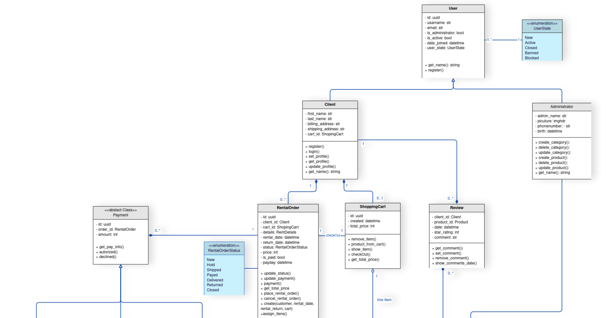
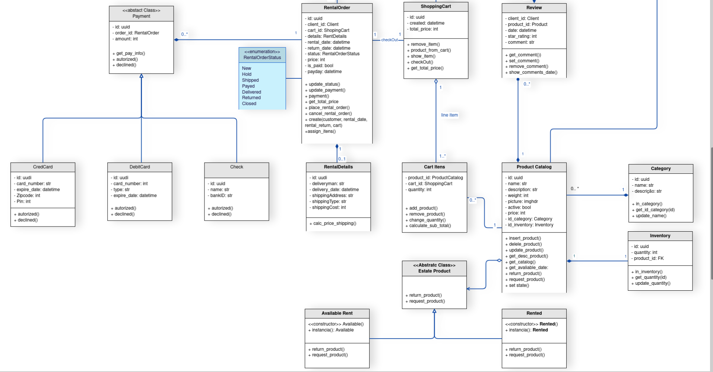

## Histórico de Versão

| Data       | Versão | Descrição                         | Autor(es)    |
| ---------- | ------ | --------------------------------- | ------------ |
| 07/03/2022 | 1.0    | Criação do documento              | Jaime Juan e Flavio |
| 16/03/2022 | 1.1    | Inserção de padrões              | Jaime Juan |

# GRASP(s)

## 1. Introdução

GRASP, sigla para General Responsability Assignment Software Patterns, são padrões que consistem em um conjunto de práticas para a atribuição de responsabilidades a classes e objetos em projetos orientados a objeto.

Assim sendo, temos os seguintes padrões utilizados:

1. Controlador (Controller)
2. Criador (Creator)
3. Indireção (Indirection)
4. Especialista na informação (Information expert)
5. Alta coesão (High cohesion)
6. Baixo acoplamento (Loose coupling)
7. Polimorfismo (Polymorphism)
8. Variações protegidas (Protected variations), e
9. Invenção pura (Pure fabrication)

Esses padrões servem para a resolução de problemas comuns e bastante típicos de desenvolvimento de software orientado a objeto. Com isso, o uso de tais técnicas apenas documentam e normatizam as práticas já consolidadas, testadas e conhecidas no mercado.

## 2. Padrões
### 2.1. Controlador (Controller)
O padrão Controller atribui a responsabilidade de manipular eventos do sistema para classes que não são da interface do usuário (UI) que representam cenários globais ou de casos de uso. Objetos de controlador são objetos de interface não-usuário responsáveis ​​por receber ou manipular eventos do sistema.

Um caso de uso de controlador deve ser usado para lidar com todos os eventos de caso de uso e pode ser usado para vários casos de uso (por exemplo, para casos de uso como criar usuário e excluir usuário, ele pode ter um controlador de usuário em vez de dois casos de uso de controlador separados ).

Ele é definido como o primeiro objeto fora da camada de interface do usuário que recebe e coordena as operações do sistema ("controles"). O controlador deve delegar o trabalho que precisa ser feito a outros objetos; ele coordena ou controla a atividade. Ele não pode fazer muito trabalho sozinho. O controlador GRASP pode ser pensado como parte da camada de aplicação/serviço (assumindo que a aplicação tem uma distinção clara entre a camada de aplicação/serviço e a camada de domínio em um sistema orientado a objetos, com uma camada comum na lógica arquitetura) sistema de informação).

### 2.2. Criador (Creator)

Criar objetos é uma das atividades mais comuns em sistemas orientados a objetos. Descobrir qual classe é responsável pela criação de um objeto é uma propriedade fundamental do relacionamento entre objetos de uma determinada classe.

Em geral, a classe `B` deve ser responsável por criar instâncias da classe `A` se uma ou mais das seguintes declarações se aplicarem:

* Instâncias de `B` contêm ou agregam instâncias de `A`;
* Instâncias de `B` gravam instâncias de `A`;
* Instâncias de `B` utilizam de perto instâncias de `A`;
* Instâncias de `B` têm as informações de iniciação das instâncias de `A` e passam isso na criação.

### 2.3. Indireção (Indirection)

O padrão de Indireção suporta o baixo acoplamento (e a possibilidade de reutilização) entre dois elementos, dando aos objetos intermediários a responsabilidade de atuar como mediadores entre eles. Um exemplo é a introdução de componentes do controlador para mediar entre dados (modelos) e suas representações (visualizações) no padrão MVC.

### 2.4. Especialista na informação (Information expert)

Especialista na informação são os princípios usados ​​para determinar onde delegar responsabilidades. Essas responsabilidades incluem métodos, campos computacionais e muito mais.

Usando os princípios do especialista em informações, a abordagem geral para atribuir responsabilidades é examinar uma responsabilidade específica, determinar as informações necessárias para executar a responsabilidade e, em seguida, determinar onde essas informações são armazenadas.

O Guia do Especialista em Informações colocará o ônus sobre a aula e fornecerá a maioria das informações necessárias para completá-la

### 2.5. Alta coesão (High cohesion)

A alta coesão é um critério de avaliação que tenta manter os objetos adequadamente focados, gerenciáveis ​​e compreensíveis. A alta coesão é geralmente usada para suporte de baixo acoplamento. Alta coesão significa que as responsabilidades de um determinado elemento estão intimamente relacionadas e altamente concentradas. Decompor um programa em classes e subsistemas é um exemplo de adição de propriedades coesivas a um sistema. Alternativamente, baixa coesão refere-se a uma situação em que um determinado elemento tem muitas responsabilidades diferentes e não relacionadas. Elementos com baixa coesão são muitas vezes difíceis de entender, reutilizar, manter e avessos a mudanças.

### 2.6. Baixo acoplamento (Loose coupling)

O acoplamento é uma medida de quão fortemente um elemento se conecta, percebe ou depende de outros elementos. O baixo acoplamento é um critério de avaliação que determina como as responsabilidades de suporte são distribuídas: 

* Há menos dependências entre classes;
* Mude uma classe com menos impacto em outras classes;
* Maior potencial de reutilização.

### 2.7. Polimorfismo (Polymorphism)

De acordo com o princípio do polimorfismo, a responsabilidade de definir as mudanças de comportamento baseadas no tipo é atribuída ao tipo que muda. Isto é conseguido usando operações polimórficas. Os usuários de tipos devem usar operações polimórficas em vez de ramificações explícitas baseadas em tipos.

### 2.8. Variações protegidas (Protected variations)

O padrão Protected Variations protege os elementos de alterações em outros elementos (objetos, sistemas, subsistemas) combinando o foco de instabilidade com uma interface e usando polimorfismo para criar várias implementações dessa interface.
### 2.9. Invenção pura (Pure fabrication)

A fabricação/invenção pura são classes artificiais que não representam conceitos no domínio do problema, especificamente projetadas para alcançar baixo acoplamento, alta coesão e potencial de reutilização de derivação (quando a solução fornecida pelo padrão especialista em informações não o é). Esse tipo de classe é chamado de "serviço" em Padrões Orientados a Domínio.

## Referências

> Larman, C. (2005) Applying UML and Patterns: An Introduction to Object-Oriented Analysis and Design and Iterative Development, Prentice Hall PTR.
> Design Patterns [Addison-Wesley Professional Computing Series] Erich Gamma, Richard Helm, Ralph Johnson, John M. Vlissides, Addison-Wesley Professional, 1994.
> BASSETTO, Nelson. RDD – Responsibility Driven Design e GRASP – General Responsibility Assignment Software Principles (2 de 2). 2011. Disponível em: http://nelsonbassetto.com/blog/tags/grasp/. Acesso em: 16 de Março de 2021.